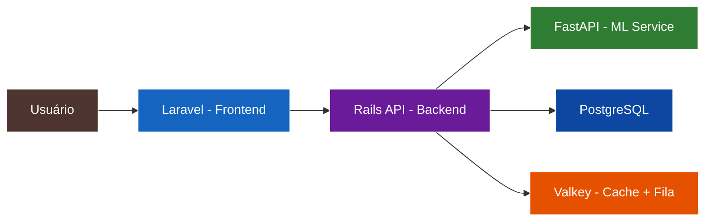
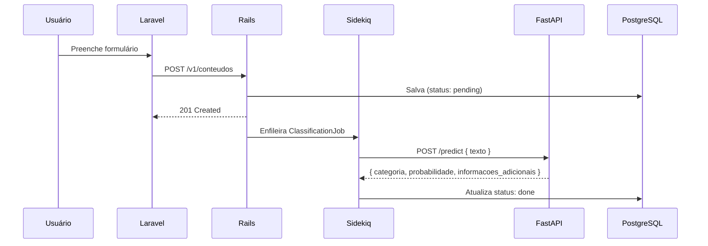

# TechMind - Organização Inteligente de Conhecimento


---

## Sobre o Projeto

O **TechMind** é um MVP de sistema de organização inteligente de conhecimento técnico. Ele permite que usuários cadastrem, classifiquem e consultem conteúdos técnicos (artigos, documentações, anotações de estudo, tutoriais) de forma automatizada, utilizando Machine Learning para categorização e extração de palavras-chave.



---

## Arquitetura

| Componente | Tecnologia | Função |
|---|---|---|
| **Frontend** | PHP 8.3 + Laravel 11 | Interface do usuário |
| **Backend** | Ruby 3.3 + Rails 7.1 (API) | Core de negócio, orquestração |
| **ML Service** | Python 3.11 + FastAPI + scikit-learn | Classificação de texto (TF-IDF + LogisticRegression) |
| **Cache** | Valkey 8 | Cache de queries + backend Sidekiq |
| **Fila** | Sidekiq (via Valkey) | Processamento assíncrono de classificação |
| **Banco** | PostgreSQL 16 | Persistência de dados |
| **Infra** | LocalStack Pro + Terraform 1.9 | AWS simulada localmente |
| **Orquestração** | Docker Compose | Ambiente 100% conteinerizado |

---

## Fluxo de Dados

### Cadastro e Classificação



### Entrada / Saída

**POST /v1/conteudos**

```json
{
  "titulo": "Introdução ao Ruby on Rails",
  "texto": "Neste conteúdo são apresentados os conceitos básicos para criação de APIs REST utilizando a linguagem Ruby e o framework Rails."
}
```

**Resposta (após classificação):**

```json
{
  "categoria": "Backend",
  "probabilidade": 0.94,
  "informacoes_adicionais": ["Ruby", "Rails", "API REST"]
}
```

---

## Estrutura do Projeto

```
tech-mind/
├── docker-compose.yml       # Orquestração de todos os serviços
├── .env                     # Variáveis de ambiente
├── .env.example             # Exemplo de variáveis de ambiente
├── .gitignore
│
├── infra/                   # Terraform + LocalStack
│   ├── provider.tf          # Provider AWS apontando para LocalStack
│   ├── main.tf              # S3 bucket + Secrets Manager
│   ├── variables.tf         # Variáveis de entrada
│   └── outputs.tf           # ARN do bucket e secret
│
├── frontend/                # PHP + Laravel
│   ├── Dockerfile
│   └── ...
│
├── backend/                 # Ruby + Rails (API mode)
│   ├── Dockerfile
│   └── ...
│
├── ml-service/              # Python + FastAPI
│   ├── Dockerfile
│   ├── requirements.txt
│   ├── model.joblib         # Modelo treinado (gerado pelo notebook)
│   ├── data/
│   │   └── train.csv        # Dataset sintético (80 exemplos)
│   ├── app/
│   │   ├── main.py
│   │   └── model/
│   └── notebooks/
│       └── techmind_ml.ipynb
│
└── docs/                    # Documentação completa
    ├── 00-visao-geral.md
    ├── 01-requisitos-funcionais.md
    ├── 02-requisitos-nao-funcionais.md
    ├── 03-arquitetura.md
    ├── 04-historias-de-usuario.md
    ├── 05-stacks-e-justificativas.md
    ├── 06-matriz-de-decisoes.md
    ├── 07-glossario.md
    ├── 08-taxonomia-ml.md
    ├── 09-contratos-api.md
    ├── 10-modelo-de-dados.md
    └── 10-variaveis-de-ambiente.md
```

---

## Requisitos

- Docker Engine 24+
- Docker Compose V2 (plugin)
- LocalStack Pro license key (via variável de ambiente)

Nenhuma dependência de Ruby, PHP ou Python é necessária na máquina host.

---

## Como Executar

```bash
# 1. Clone o repositório
git clone https://github.com/DessimA/tech-mind.git
cd tech-mind

# 2. Configure a chave do LocalStack Pro
export LOCALSTACK_AUTH_TOKEN=sua-chave-aqui

# 3. Inicie todos os serviços
docker compose up -d

# 4. Provisione a infraestrutura (S3 + Secrets Manager)
docker compose run --rm terraform init
docker compose run --rm terraform apply -auto-approve

# 5. Acesse
# Frontend (Laravel): http://localhost:80
# (portas 3000 e 8000 são acessíveis apenas na rede interna do Docker;
#  para debug, use: docker compose exec backend curl localhost:3000)
```

---

## Documentação

Documentação completa disponível em [`docs/`](docs/):

| Documento | Descrição |
|---|---|
| [00-visao-geral.md](docs/00-visao-geral.md) | Visão geral, objetivos e critérios de sucesso |
| [01-requisitos-funcionais.md](docs/01-requisitos-funcionais.md) | 6 requisitos funcionais com diagramas |
| [02-requisitos-nao-funcionais.md](docs/02-requisitos-nao-funcionais.md) | 9 requisitos não funcionais |
| [03-arquitetura.md](docs/03-arquitetura.md) | Arquitetura C4 com diagramas Mermaid |
| [04-historias-de-usuario.md](docs/04-historias-de-usuario.md) | 6 histórias de usuário (INVEST) |
| [05-stacks-e-justificativas.md](docs/05-stacks-e-justificativas.md) | Stacks e justificativas das escolhas |
| [06-matriz-de-decisoes.md](docs/06-matriz-de-decisoes.md) | Matriz de decisões do projeto |
| [07-glossario.md](docs/07-glossario.md) | Glossário de termos técnicos |
| [08-taxonomia-ml.md](docs/08-taxonomia-ml.md) | Taxonomia de categorias do ML |
| [09-contratos-api.md](docs/09-contratos-api.md) | Contratos formais das APIs (request/response) |
| [10-modelo-de-dados.md](docs/10-modelo-de-dados.md) | Schema do banco de dados, índices e estratégia de busca |
| [10-variaveis-de-ambiente.md](docs/10-variaveis-de-ambiente.md) | Variáveis de ambiente do projeto |

---

## Testes

```bash
# Rodar testes de todos os serviços
docker compose --profile test up --abort-on-container-exit
```

Frameworks: PHPUnit (Laravel), RSpec + FactoryBot (Rails), Pytest (FastAPI).

---

## Contribuição

Contribuições são bem-vindas! Veja [CONTRIBUTING.md](CONTRIBUTING.md) para guia completo.

- Reporte bugs em [Issues](https://github.com/DessimA/tech-mind/issues/new?template=bug_report.md)
- Sugira features em [Issues](https://github.com/DessimA/tech-mind/issues/new?template=feature_request.md)

## Segurança

Vulnerabilidades devem ser reportadas conforme descrito em [SECURITY.md](SECURITY.md). Não abra issues públicas.

## Código de Conduta

Este projeto adota o [Contributor Covenant](CODE_OF_CONDUCT.md). Participe de forma respeitosa e inclusiva.

## Suporte

Veja [SUPPORT.md](SUPPORT.md) para dúvidas frequentes e canais de suporte.

---

## Licença

Distribuído sob licença MIT. Veja [LICENSE](LICENSE) para mais informações.
