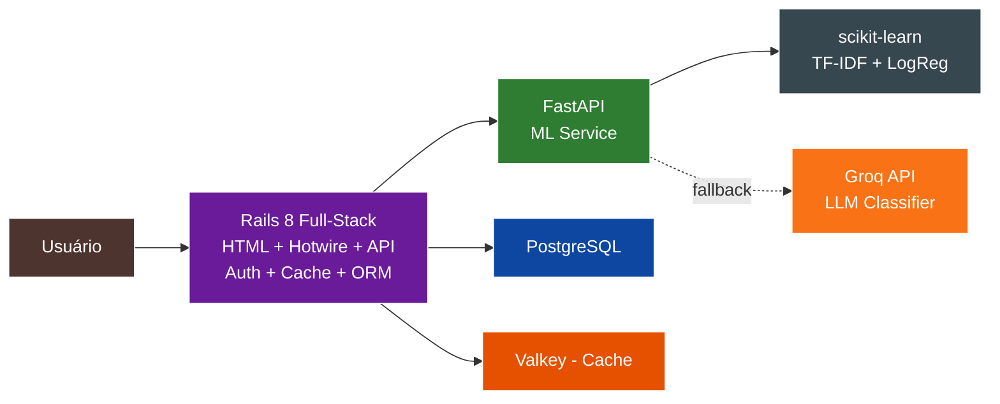

# TechMind - Organização Inteligente de Conhecimento


---

## Sobre o Projeto

O **TechMind** é um MVP de sistema de organização inteligente de conhecimento técnico. Construído com **Rails 8 full-stack** (HTML + Hotwire + API) e **FastAPI** para classificação ML híbrida — modelo local scikit-learn com fallback inteligente para **LLM via Groq API**.



---

## Arquitetura (2 Serviços)

| Componente | Tecnologia | Função |
|---|---|---|
| **Web App** | Ruby 3.3 + Rails 8.1 + Hotwire | Full-stack: HTML, API, Auth, Cache, ORM |
| **ML Service** | Python 3.11 + FastAPI + scikit-learn + Groq | Classificação híbrida (local + LLM fallback) |
| **Cache** | Valkey 8 / Redis Cloud | Cache de queries |
| **Banco** | PostgreSQL 16 (Supabase) | Persistência de dados |
| **Hospedagem** | Render + Supabase | Cloud gratuita (free tier) |

> 🎯 **Decisão arquitetural:** Em vez de manter dois frameworks web (Laravel + Rails), consolidamos tudo no **Rails 8 full-stack**. Rails entrega HTML com Hotwire (Turbo + Stimulus), provê API, autenticação e orquestração em um único serviço. Isso reduz o consumo de RAM de 1.5GB para 1GB, elimina latência de rede entre frontend/backend e simplifica a manutenção.

---

## Status dos Testes

| Serviço | Framework | Testes | Status |
|---|---|---|---|
| **Web (Rails)** | RSpec | **60 testes** (models + requests + auth) | ✅ Passando |
| **ML (FastAPI)** | Pytest | **16 testes** (predição + health + fallback Groq) | ✅ Passando |

---

## Como Executar (Desenvolvimento Local)

```bash
# 1. Clone e configure
git clone https://github.com/DessimA/tech-mind.git
cd tech-mind
cp .env.example .env

# 2. Edite .env e adicione as chaves necessárias
# GROQ_API_KEY=sua-chave-groq
# SECRET_KEY_BASE=$(rails secret)

# 3. Inicie os serviços
docker compose up -d

# 4. Acesse http://localhost:3000

# 5. Para rodar os testes:
docker compose run --rm web-test    # RSpec (60 testes)
docker compose run --rm ml pytest    # Pytest (16 testes)
```

---

## Documentação

Documentação completa em [`docs/`](docs/):

| Documento | Descrição |
|---|---|
| [00-visao-geral.md](docs/00-visao-geral.md) | Visão geral, objetivos e critérios de sucesso |
| [01-requisitos-funcionais.md](docs/01-requisitos-funcionais.md) | Requisitos funcionais (auth, conteúdo, classificação) |
| [02-requisitos-nao-funcionais.md](docs/02-requisitos-nao-funcionais.md) | Requisitos não funcionais + resiliência free tier |
| [03-arquitetura.md](docs/03-arquitetura.md) | Arquitetura C4: Rails full-stack + FastAPI |
| [04-historias-de-usuario.md](docs/04-historias-de-usuario.md) | Histórias de usuário |
| [05-stacks-e-justificativas.md](docs/05-stacks-e-justificativas.md) | Stacks e justificativas |
| [06-matriz-de-decisoes.md](docs/06-matriz-de-decisoes.md) | Matriz de decisões do projeto |
| [07-glossario.md](docs/07-glossario.md) | Glossário de termos técnicos |
| [08-taxonomia-ml.md](docs/08-taxonomia-ml.md) | Taxonomia de categorias + Groq fallback |
| [09-contratos-api.md](docs/09-contratos-api.md) | Contratos formais das APIs |
| [10-modelo-de-dados.md](docs/10-modelo-de-dados.md) | Schema do banco (users + conteudos) |
| [10-variaveis-de-ambiente.md](docs/10-variaveis-de-ambiente.md) | Variáveis de ambiente |
