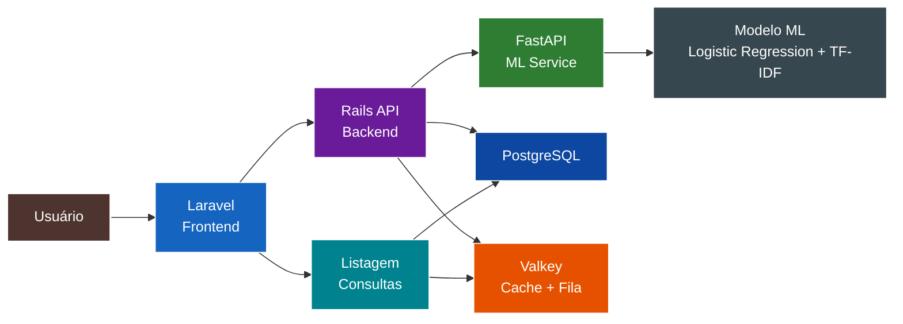
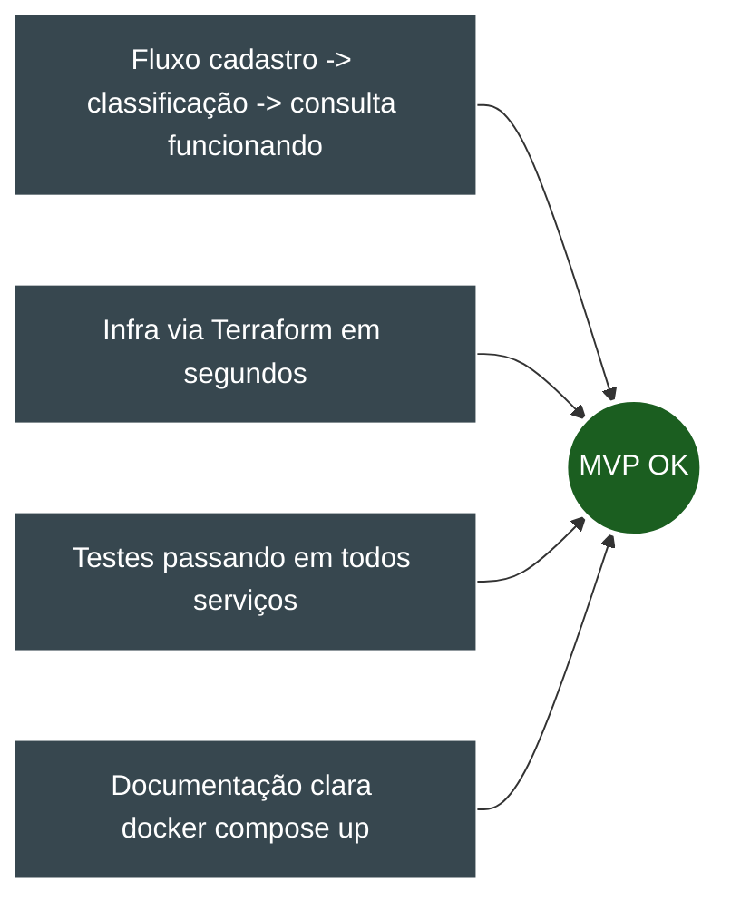

# Visão Geral do Projeto - TechMind

## 1. Propósito

O **TechMind** é um MVP de sistema de organização inteligente de conhecimento técnico. Ele permite que usuários cadastrem, classifiquem e consultem conteúdos técnicos (artigos, documentações, anotações de estudo, tutoriais) de forma automatizada, utilizando Machine Learning para categorização e extração de palavras-chave.

## 2. Contexto

Profissionais de tecnologia consomem e produzem grande volume de conteúdo técnico diariamente. Sem uma ferramenta de organização inteligente, esse conhecimento fica disperso em arquivos soltos, bookmarks e anotações desconectadas. O TechMind resolve esse problema oferecendo:

- Cadastro centralizado de conteúdos
- Classificação automática por categoria via ML
- Extração de palavras-chave relevantes
- Consulta e reutilização facilitadas

## 3. Objetivos

- Fornecer uma plataforma funcional (MVP) de organização de conhecimento
- Demonstrar integração entre microsserviços (PHP, Ruby, Python)
- Provisionar infraestrutura cloud simulada via IaC (Terraform + LocalStack)
- Utilizar Docker para ambiente 100% conteinerizado, sem dependências locais

## 4. Fluxo Principal do Sistema

## 5. Público-Alvo

- Desenvolvedores de software
- Estudantes de tecnologia
- Profissionais de TI que consomem conteúdo técnico regularmente

## 6. Restrições de Escopo (MVP)

- Sem autenticação de usuário (adiada para pós-MVP)
- Processamento assíncrono via Sidekiq
- Cache com Valkey para otimização de consultas
- Modelo ML: Logistic Regression + TF-IDF
- Ambiente 100% Docker

## 7. Critérios de Sucesso

