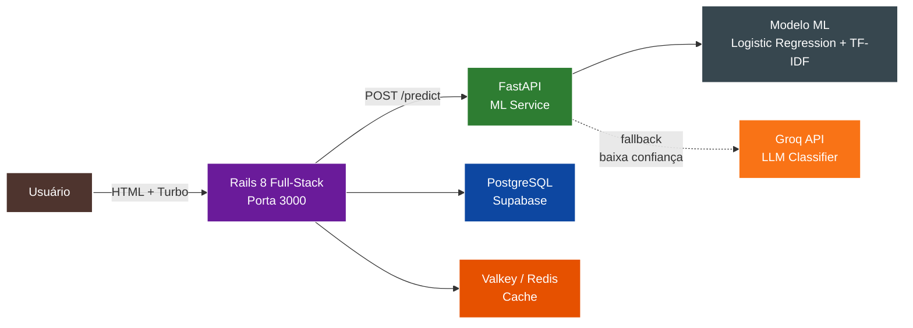
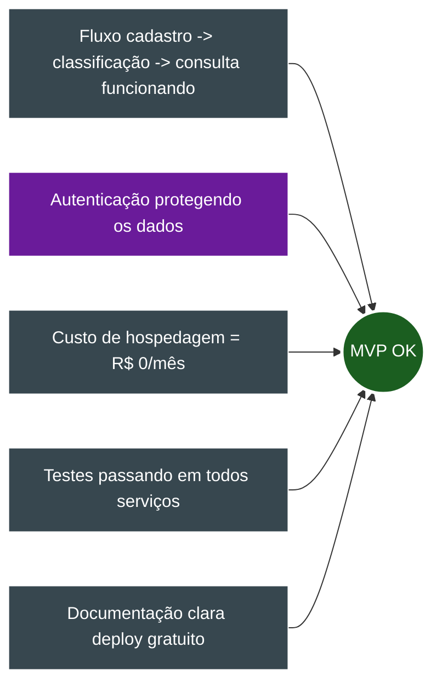

# Visão Geral do Projeto - TechMind

## 1. Propósito

O **TechMind** é um sistema de organização inteligente de conhecimento técnico. Construído com **Rails 8 full-stack** (HTML + Hotwire + API) e **FastAPI** (ML Service), ele permite que usuários se cadastrem, cadastrem conteúdos técnicos e os classifiquem automaticamente via Machine Learning híbrido (scikit-learn + Groq API fallback).

## 2. Contexto

Profissionais de tecnologia consomem e produzem grande volume de conteúdo técnico diariamente. Sem uma ferramenta de organização inteligente, esse conhecimento fica disperso em arquivos soltos, bookmarks e anotações desconectadas.

O TechMind resolve isso oferecendo:
- Cadastro centralizado de conteúdos (associado ao usuário logado)
- Classificação automática por categoria via ML (modelo local + LLM fallback)
- Extração de palavras-chave relevantes
- Autenticação por sessão (Rails nativa, sem JWT)
- Hospedagem 100% gratuita (free tiers)

## 3. Objetivos

- Fornecer uma plataforma funcional (MVP) de organização de conhecimento
- **Arquitetura enxuta:** 2 serviços apenas (Rails full-stack + FastAPI ML)
- Classificação híbrida: scikit-learn (rápido e leve) + Groq API (fallback inteligente)
- Hospedar em serviços cloud gratuitos (Render + Supabase)
- Utilizar Docker para ambiente de desenvolvimento local

## 4. Fluxo Principal do Sistema

## 5. Público-Alvo

- Desenvolvedores de software
- Estudantes de tecnologia
- Profissionais de TI que consomem conteúdo técnico regularmente

## 6. Restrições de Escopo (MVP)

- **Arquitetura de 2 serviços:** Rails 8 full-stack + FastAPI ML
- Autenticação por sessão Rails (`has_secure_password`)
- Cada conteúdo é associado a um usuário (`user_id`)
- Processamento síncrono da classificação (ML leve, sem filas)
- Cache com Valkey/Redis (fallback para memória)
- Modelo ML: Logistic Regression + TF-IDF com **fallback para Groq API**
- Hospedagem gratuita em Render + Supabase

## 7. Princípios de Arquitetura

| Princípio | Descrição |
|---|---|
| **Enxuto** | Apenas 2 serviços web (Rails + FastAPI). Nada de Laravel ou frameworks extras. |
| **Full-Stack Rails** | Um único framework cuida de HTML, API, auth, cache e ORM. |
| **Stateless** | Nenhum serviço armazena estado interno que não possa ser recriado. |
| **Fail Fast** | Chamadas entre serviços têm timeout; se exceder, falha rápido. |
| **Degradação Graciosa** | Se o ML cai, o conteúdo é salvo como `failed` — o usuário não perde dados. |

> 📖 **Detalhes completos:** [`docs/11-responsabilidades-e-resiliencia.md`](docs/11-responsabilidades-e-resiliencia.md)

## 8. Critérios de Sucesso

