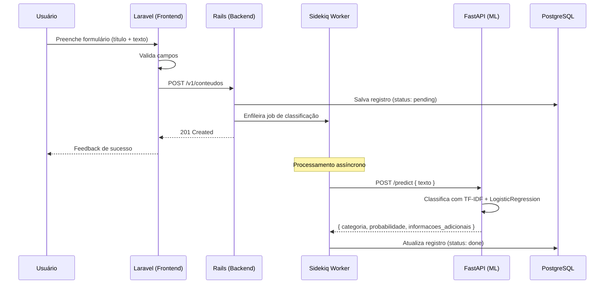
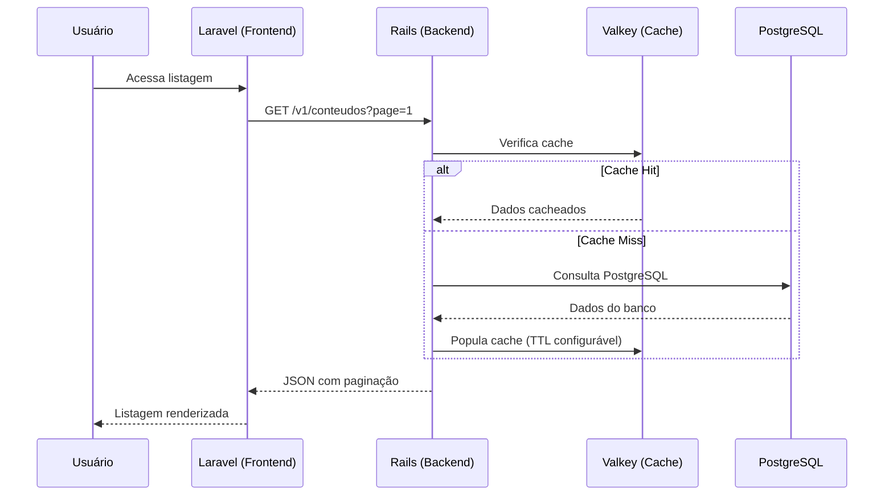
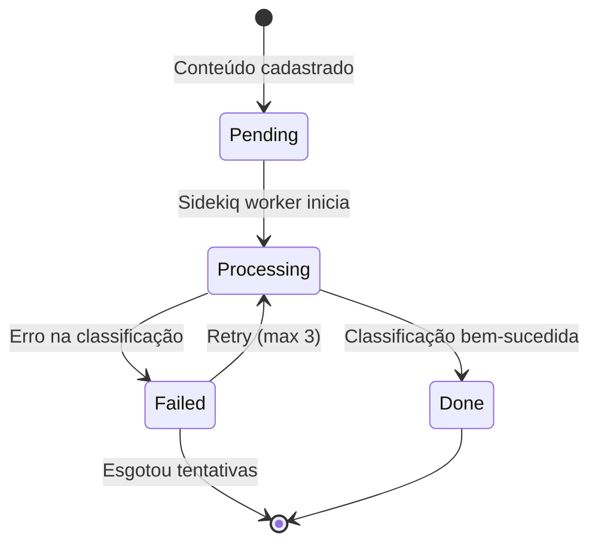

# Requisitos Funcionais - TechMind

## RF01 - Cadastro de Conteúdo Técnico

**Descrição:** O usuário deve poder cadastrar um conteúdo técnico informando título e texto.

**Critérios de Aceitação:**
- O frontend (Laravel) deve expor formulário com campos `titulo` (string, obrigatório) e `texto` (string, obrigatório)
- `titulo`: mínimo 3 caracteres, máximo 200
- `texto`: mínimo 10 caracteres, máximo 5000
- O formulário deve validar os campos antes de enviar ao backend
- O backend (Rails) deve receber os dados via `POST /v1/conteudos`
- O Rails deve salvar o registro no PostgreSQL e disparar a classificação via Sidekiq
- O usuário deve receber feedback visual de sucesso ou erro

## RF02 - Classificação Automática de Conteúdo

**Descrição:** Ao cadastrar um conteúdo, o sistema deve classificá-lo automaticamente em uma categoria e extrair palavras-chave.

**Critérios de Aceitação:**
- O Sidekiq job deve enviar o texto ao microsserviço ML (`POST /predict`)
- O FastAPI deve retornar `categoria`, `probabilidade` e `informacoes_adicionais` (keywords)
- O resultado deve ser armazenado no PostgreSQL junto ao conteúdo
- O tempo total de classificação (job) não deve ser perceptível ao usuário na tela de cadastro

**Diagrama do Fluxo:**

## RF03 - Consulta e Listagem de Conteúdos

**Descrição:** O usuário deve poder consultar e listar os conteúdos cadastrados.

**Critérios de Aceitação:**
- O frontend deve exibir listagem paginada dos conteúdos
- Cada item deve mostrar título, categoria, palavras-chave e data de criação
- O backend deve expor `GET /v1/conteudos` com suporte a paginação
- Resultados de consultas frequentes devem ser cacheados no Valkey
- O usuário pode pesquisar por título ou palavras-chave

**Diagrama do Fluxo:**

## RF04 - Health Check dos Serviços

**Descrição:** Cada microsserviço deve expor um endpoint de health check.

**Critérios de Aceitação:**
- Laravel: `GET /health` -> 200 OK
- Rails: `GET /v1/health` -> 200 OK + status do banco/Sidekiq
- FastAPI: `GET /health` -> 200 OK + status do modelo carregado
- O docker-compose deve utilizar healthchecks para garantir ordem de inicialização

## RF05 - Provisionamento de Infraestrutura

**Descrição:** A infraestrutura AWS simulada deve ser provisionada via Terraform.

**Critérios de Aceitação:**
- `terraform init` e `terraform apply` devem executar sem erros
- O bucket S3 `techmind-content` deve ser criado
- Os secrets no AWS Secrets Manager devem ser criados com valores mockados
- Todo o provisionamento deve apontar para o LocalStack (não para AWS real)

## RF06 - Processamento Assíncrono com Filas

**Descrição:** A classificação de conteúdo deve ocorrer de forma assíncrona via Sidekiq.

**Critérios de Aceitação:**
- Ao cadastrar um conteúdo, um Sidekiq job deve ser enfileirado
- O worker deve consumir a fila e chamar o FastAPI
- Em caso de falha, o job deve ser retentado até 3 vezes
- O status do processamento deve ser atualizado no banco (pending/processing/done/failed)

