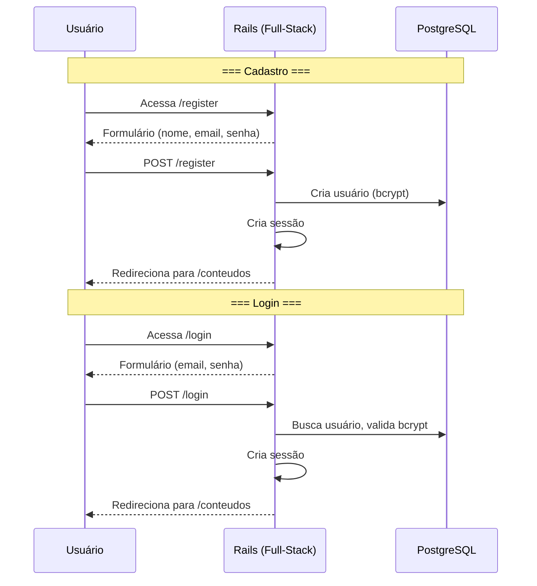
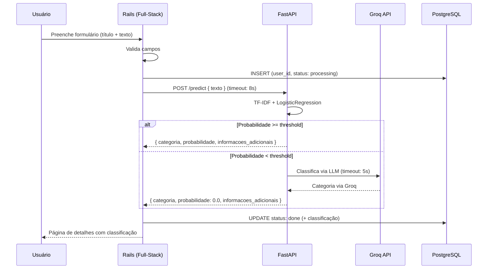

# Requisitos Funcionais - TechMind

## RF01 - Autenticação de Usuário

**Descrição:** O usuário deve poder se cadastrar e fazer login no sistema para acessar seus conteúdos.

**Critérios de Aceitação:**
- **Cadastro:** formulário com nome, email e senha (mín. 6 caracteres)
- **Login:** formulário com email e senha
- Autenticação via **sessão Rails nativa** (`has_secure_password` + bcrypt)
- Após login, o usuário é redirecionado para a listagem de conteúdos
- Após cadastro, o usuário é redirecionado para a listagem (já autenticado)
- Rotas de conteúdo exigem autenticação (redirecionam para login se não autenticado)
- Rate limit de 10 tentativas de login por minuto (anti brute force)

## RF02 - Cadastro de Conteúdo Técnico

**Descrição:** O usuário autenticado deve poder cadastrar um conteúdo técnico informando título e texto.

**Critérios de Aceitação:**
- Formulário com campos `titulo` (string, obrigatório, 3-200 caracteres) e `texto` (string, obrigatório, 10-5000 caracteres)
- O Rails valida os campos e salva no PostgreSQL **associado ao `user_id` da sessão**
- Durante o cadastro, o Rails chama o FastAPI (`POST /predict`) sincronamente para classificar o texto
- O usuário vê o resultado da classificação **imediatamente** na página de detalhes
- **Timeout da chamada ao ML: 8s** — se exceder, conteúdo salvo como `failed` e usuário pode tentar novamente

## RF03 - Consulta e Listagem de Conteúdos

**Descrição:** O usuário autenticado deve poder consultar e listar seus próprios conteúdos.

**Critérios de Aceitação:**
- Listagem paginada com título, categoria, palavras-chave e data
- Apenas conteúdos do usuário logado (filtro por `user_id` da sessão)
- Paginação: 20 itens por página
- Ordenação: mais recentes, mais antigos, título A-Z
- Busca por título (ILIKE) e palavras-chave (índice GIN)
- Resultados cacheados (Redis ou memória)

## RF04 - Classificação Híbrida (ML + Groq)

**Descrição:** Ao cadastrar um conteúdo, o sistema deve classificá-lo automaticamente usando modelo local com fallback para Groq API.

**Critérios de Aceitação:**
- O Rails envia o texto ao FastAPI (`POST /predict`) sincronamente
- FastAPI tenta classificar com TF-IDF + LogisticRegression
- Se probabilidade >= `ML_THRESHOLD` (default 0.5): retorna categoria local
- Se probabilidade < threshold: fallback para Groq API (timeout: 5s)
- Resultado armazenado no PostgreSQL
- Se ML Service estiver fora: conteúdo salvo como `failed`
- Tempo total esperado: < 2s (local) / ~1s (com fallback Groq)

## RF05 - Deploy em Cloud Gratuita

**Descrição:** O sistema deve ser implantável em free tiers.

**Critérios de Aceitação:**
- **2 web services** no Render (Rails + FastAPI)
- PostgreSQL via Supabase (500MB, sem expiração)
- Redis via Redis Cloud (30MB grátis) ou cache em memória como fallback
- Groq API gratuita para fallback de classificação
- Nenhum recurso pago necessário

## RF06 - Health Check

**Descrição:** Cada microsserviço deve expor health check.

**Critérios de Aceitação:**
- Rails: `GET /health` -> 200 OK + status do banco e Redis
- FastAPI: `GET /health` -> 200 OK + status do modelo e Groq
- Docker Compose usa healthchecks para ordem de inicialização

## Proteção de Rotas

| Rota | Autenticação | Descrição |
|---|---|---|
| `GET /login` | ❌ Pública | Página de login |
| `GET /register` | ❌ Pública | Página de cadastro |
| `POST /login` | ❌ Pública | Login |
| `POST /register` | ❌ Pública | Cadastro |
| `GET /conteudos` | ✅ Sessão Obrigatória | Listagem de conteúdos |
| `GET /conteudos/:id` | ✅ Sessão Obrigatória | Detalhes do conteúdo |
| `POST /conteudos` | ✅ Sessão Obrigatória | Cadastro de conteúdo |
| `GET /health` | ❌ Pública | Health check |
