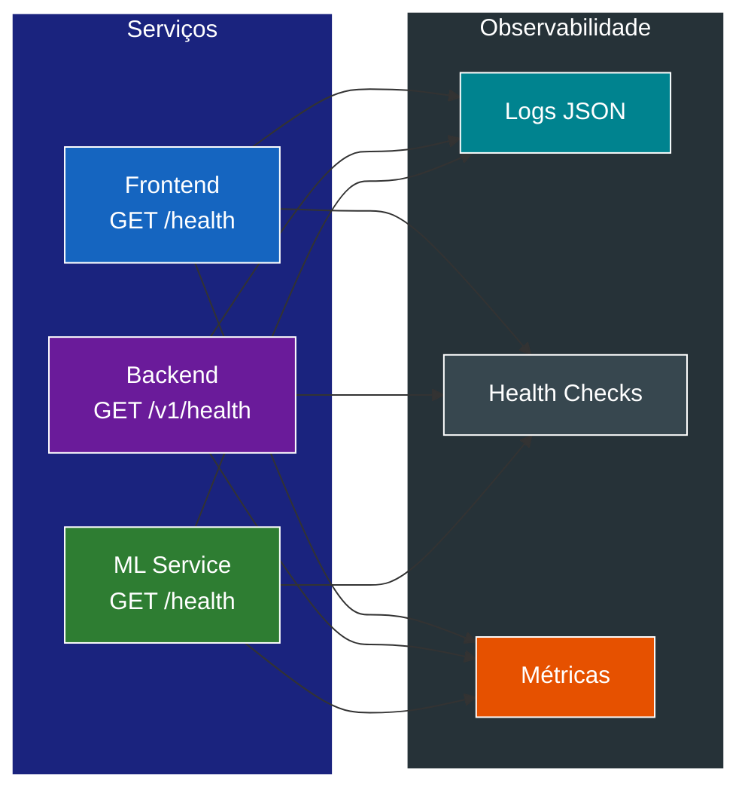
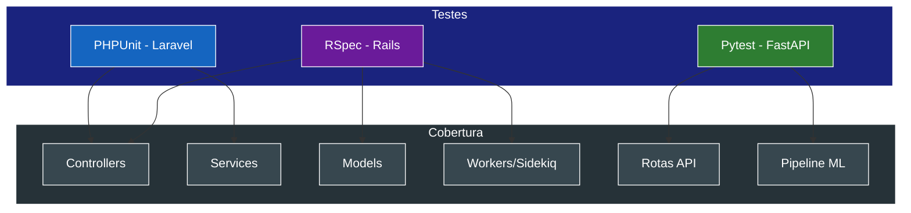

# Requisitos Não Funcionais - TechMind

## RNF01 - Ambiente 100% Conteinerizado

**Descrição:** Todos os serviços devem rodar exclusivamente via Docker, sem instalação de dependências no host.

**Critérios de Aceitação:**
- Um único comando (`docker compose up`) deve iniciar todo o ecossistema
- Nenhuma instalação de Ruby, PHP, Python ou PostgreSQL é necessária na máquina host
- Volumes montados devem permitir hot reload em desenvolvimento

```mermaid
flowchart LR
    subgraph Host [Máquina Host - Nenhuma dependência instalada]
        Docker[Docker Engine]
    end

    subgraph Compose [Docker Compose]
        direction TB
        LS[LocalStack Pro]
        PG[PostgreSQL]
        VK[Valkey]
        ML[FastAPI - ML]
        BE[Rails - Backend]
        SQ[Sidekiq - Workers]
        FE[Laravel - Frontend]
        TF[Terraform]
    end

    Host --> Compose

    style Host fill:#3E2723,color:#fff,stroke:#fff
    style Docker fill:#455A64,color:#fff,stroke:#fff
    style Compose fill:#1A237E,color:#fff,stroke:#fff
    style LS fill:#00838F,color:#fff,stroke:#fff
    style PG fill:#0D47A1,color:#fff,stroke:#fff
    style VK fill:#E65100,color:#fff,stroke:#fff
    style ML fill:#2E7D32,color:#fff,stroke:#fff
    style BE fill:#6A1B9A,color:#fff,stroke:#fff
    style SQ fill:#8E24AA,color:#fff,stroke:#fff
    style FE fill:#1565C0,color:#fff,stroke:#fff
    style TF fill:#37474F,color:#fff,stroke:#fff
```

## RNF02 - Infraestrutura como Código (IaC)

**Descrição:** Todos os recursos de infraestrutura devem ser declarados via Terraform.

**Critérios de Aceitação:**
- Provisionamento idempotente (terraform apply pode ser executado múltiplas vezes)
- Estado do Terraform armazenado localmente (backend local)
- Recursos AWS simulados via LocalStack Pro

## RNF03 - Observabilidade

**Descrição:** O sistema deve expor health checks e logs estruturados.

**Critérios de Aceitação:**
- Endpoints `/health` em todos os serviços
- Logs em formato JSON em produção
- Métricas básicas de requests e erros em cada serviço

## RNF04 - Performance e Cache

**Descrição:** Consultas frequentes devem ser otimizadas com cache.

**Critérios de Aceitação:**
- Listagens paginadas comuns devem ser cacheadas no Valkey (TTL configurável)
- O cache deve ser invalidado ao cadastrar novo conteúdo
- Tempo de resposta para listagens cacheadas < 50ms

## RNF05 - Resiliência e Filas

**Descrição:** Processamento assíncrono com tolerância a falhas.

**Critérios de Aceitação:**
- Jobs com falha devem ser retentados automaticamente (max 3 tentativas)
- Falhas persistentes devem marcar o conteúdo como `failed` no banco
- O Sidekiq deve ser configurado com backoff exponencial

## RNF06 - Testes Automatizados

**Descrição:** Cada serviço deve conter testes automatizados.

**Critérios de Aceitação:**
- Laravel: testes com PHPUnit cobrindo controllers e services
- Rails: testes com RSpec cobrindo models, controllers e workers
- FastAPI: testes com Pytest cobrindo rotas e pipeline de ML
- Testes devem rodar em container separado (profile de test)

## RNF07 - Segurança

**Descrição:** Secrets e credenciais gerenciados via AWS Secrets Manager (LocalStack).

**Critérios de Aceitação:**
- Nenhuma credencial hardcoded nos arquivos de configuração
- Secrets armazenados no LocalStack Secrets Manager
- Conexões entre serviços ocorrem na rede interna do Docker
- O Rails deve ler as credenciais do PostgreSQL do Secrets Manager no boot, com retry (5 tentativas, intervalo de 2s) e fallback para variáveis de ambiente em caso de indisponibilidade do LocalStack ou do secret
- O Terraform é executado manualmente após o `docker compose up -d`; o retry no boot do Rails garante que o secret seja lido assim que estiver disponível, sem exigir `depends_on` entre serviços

## RNF08 - Versionamento de API

**Descrição:** A API do backend (Rails) deve ser versionada.

**Critérios de Aceitação:**
- Todos os endpoints sob prefixo `/v1/`
- Mudanças futuras podem coexistir com versões anteriores via `/v2/`

## RNF09 - Rate Limiting

**Descrição:** A API deve ter proteção contra abuso.

**Critérios de Aceitação:**
- Limite de 100 requests/minuto por IP real do cliente nos endpoints do Rails
- O Laravel deve repassar o IP real do cliente via header `X-Forwarded-For`
- O Rails deve confiar no header `X-Forwarded-For` apenas por estar acessível exclusivamente na rede interna do Docker (sem risco de spoofing externo)
- Resposta 429 Too Many Requests ao exceder o limite
- Rate limit configurável via variável de ambiente
