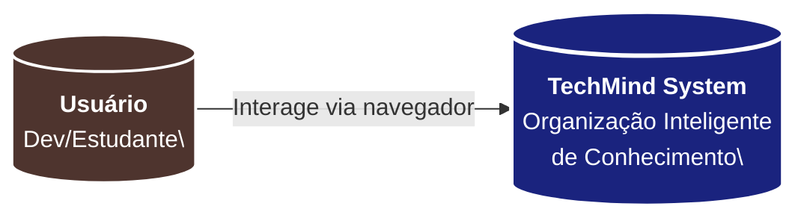
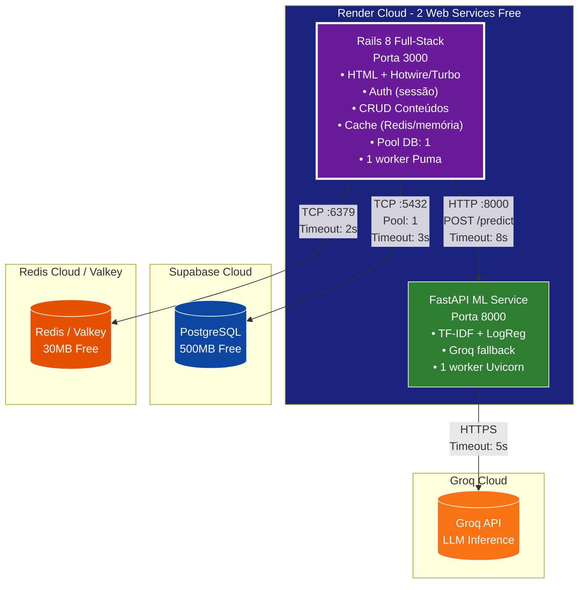
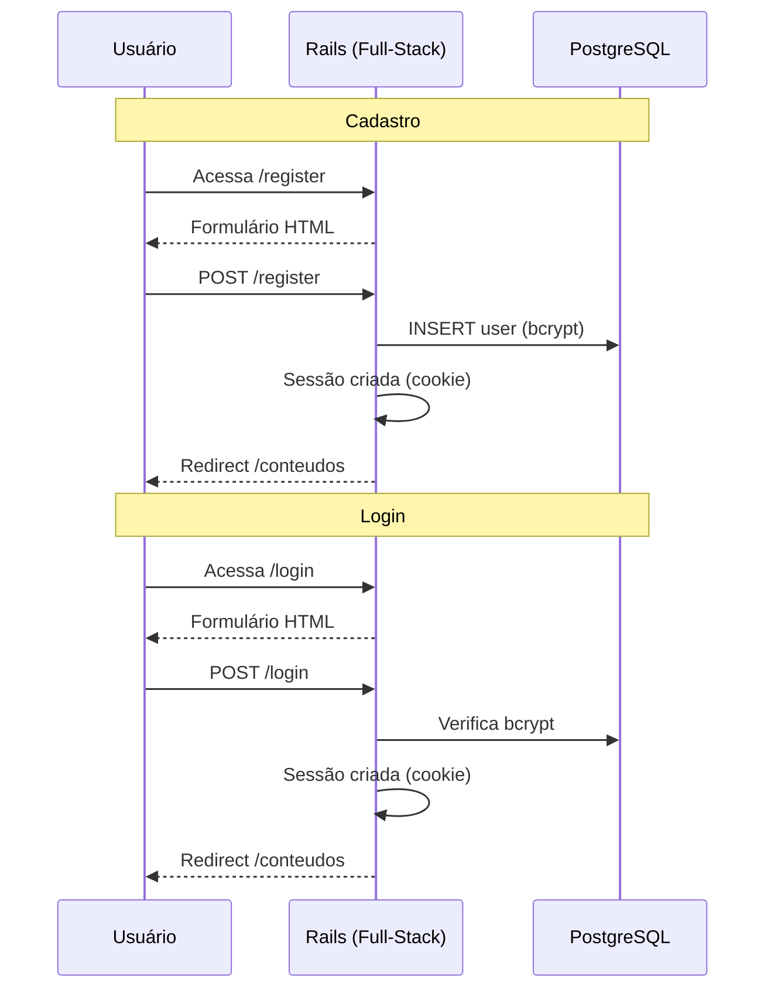
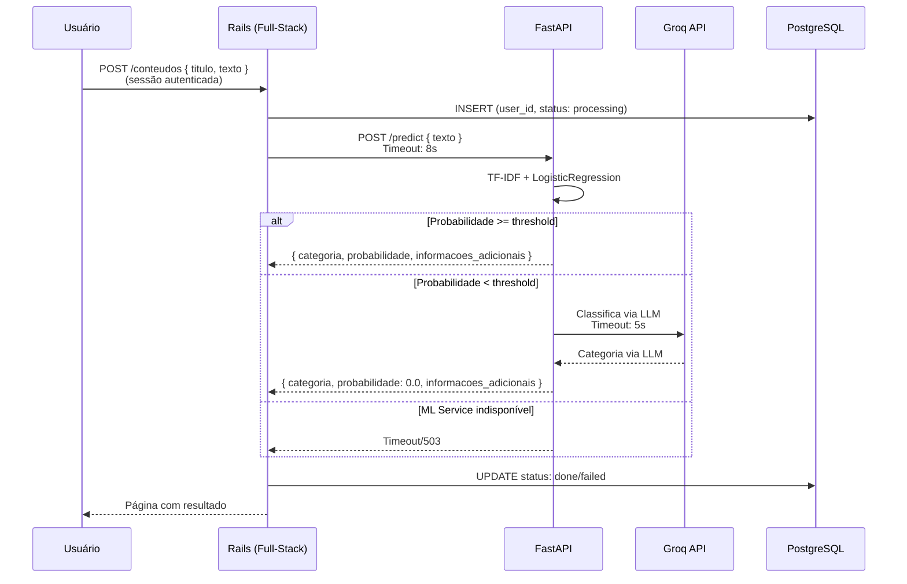

# Arquitetura do Sistema - TechMind

## 1. Visão Geral (C4 Nível 1)

## 2. Diagrama de Containers (C4 Nível 2) — 2 Serviços

### Por que apenas 2 serviços?

| Motivo | Explicação |
|---|---|
| **Rails faz tudo** | HTML views (Hotwire), API JSON, auth (sessão), cache, ORM. Tudo num processo só. |
| **Sem Laravel** | Elimina redundância: dois frameworks web fazendo a mesma coisa. |
| **1 deploy vs 3** | Antes eram 3 web services (Laravel + Rails + FastAPI). Agora 2. |
| **Menos RAM** | 1GB vs 1.5GB de consumo no free tier. |
| **Menos latência** | Zero hops HTTP entre frontend e backend (mesmo processo). |
| **Menos complexidade** | Uma codebase, um ecossistema de gems, uma pipeline. |

## 3. Fluxo de Autenticação (Sessão Rails)

## 4. Fluxo de Classificação (Cadastro de Conteúdo)

## 5. Limites de Recursos (Free Tier)

| Serviço | RAM | Workers | Pool DB | Timeouts |
|---|---|---|---|---|
| **Rails** | 512 MB | 1 Puma (1 thread) | **1 conexão** | DB: 3s / Redis: 2s / ML: 8s |
| **FastAPI** | 512 MB | 1 Uvicorn | Stateless | Groq: 5s |

> ⚠️ Supabase free tier limita a **2 conexões simultâneas**. Pool do Rails = 1 para nunca estourar.

## 6. Decisões Arquiteturais

| Decisão | Escolha | Justificativa |
|---|---|---|
| Framework web | **Rails 8 full-stack** | HTML + API + Auth + ORM em 1 serviço |
| Frontend | **Hotwire (Turbo + Stimulus)** | SPA-like sem JavaScript pesado; convention over configuration |
| ML Service | **FastAPI + scikit-learn** | Python é padrão para ML; FastAPI é leve |
| Processamento | **Síncrono** | ML leve; sem filas (Render free não tem workers) |
| Autenticação | **Sessão Rails + bcrypt** | Nativo do Rails; sem JWT, sem complexidade |
| Banco | **Supabase PostgreSQL** | 500MB grátis, sem expiração |
| Cache | **Redis Cloud / memória** | 30MB grátis; fallback para cache em memória |
| Orquestração (dev) | **Docker Compose** | Simples, 1 comando para subir tudo |
