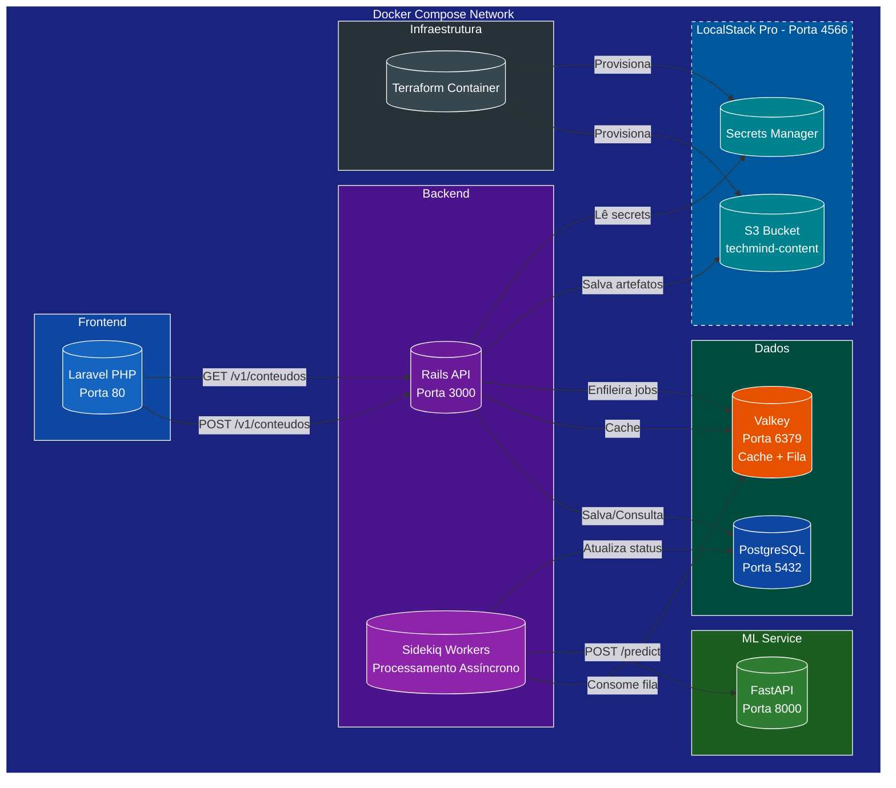
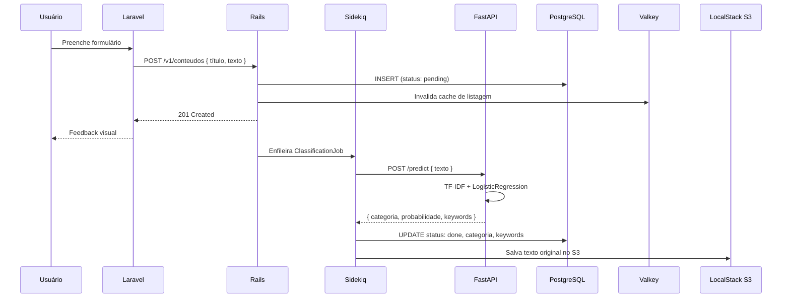
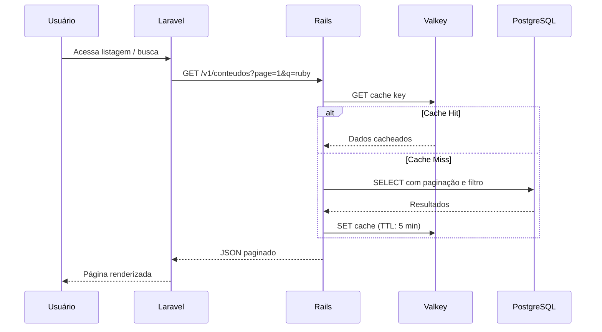

# Arquitetura do Sistema - TechMind

## 1. Visão Geral (C4 Nível 1 - Contexto)

```mermaid
flowchart LR
    Usuario[("<b>Usuário</b><br/>Dev/Estudante)"] -->|Interage via navegador| TM[("<b>TechMind System</b><br/>Organização Inteligente<br/>de Conhecimento")]

    style Usuario fill:#4E342E,color:#fff,stroke:#fff,stroke-width:2px
    style TM fill:#1A237E,color:#fff,stroke:#fff,stroke-width:3px
```

O usuário interage com o sistema via navegador web para cadastrar e consultar conteúdos técnicos.

## 2. Diagrama de Containers (C4 Nível 2)



## 3. Fluxo de Dados (Cadastro + Classificação)



## 4. Fluxo de Dados (Consulta)



## 5. Decisões Arquiteturais

| Decisão | Opção | Justificativa |
|---|---|---|
| Orquestração | Docker Compose | Simplicidade para MVP, 1 comando para subir tudo |
| API Gateway | Nenhum (direto) | MVP sem necessidade de gateway; reconsiderar com autenticação |
| Banco relacional | PostgreSQL | Maturidade, ecossistema Rails robusto, recursos do LocalStack |
| Cache + Fila | Valkey (Redis OSS) | Compatibilidade total com Sidekiq, open source |
| ML assíncrono | Sidekiq job | Não bloquear o request do usuário; resiliência com retry |
| ML como serviço separado | FastAPI + scikit-learn | Separação de concerns; permite escalar ML independentemente |
| Infra mockada | LocalStack Pro | Fidelidade à AWS sem custos; S3 e Secrets Manager funcionais |

## 6. Ordem de Inicialização dos Containers

```mermaid
flowchart TB
    LS[1. LocalStack<br/>Serviços AWS mockados] --> PG[2. PostgreSQL<br/>Banco de dados]
    PG --> VK[3. Valkey<br/>Cache + Fila Sidekiq]
    VK --> ML[4. FastAPI (ML)<br/>Serviço de classificação]
    ML --> BE[5. Rails (Backend)<br/>API + Sidekiq workers]
    BE --> FE[6. Laravel (Frontend)<br/>Interface do usuário]
    FE --> TF[7. Terraform (opcional)<br/>Provisionamento IaC]

    style LS fill:#00838F,color:#fff,stroke:#fff
    style PG fill:#0D47A1,color:#fff,stroke:#fff
    style VK fill:#E65100,color:#fff,stroke:#fff
    style ML fill:#2E7D32,color:#fff,stroke:#fff
    style BE fill:#6A1B9A,color:#fff,stroke:#fff
    style FE fill:#1565C0,color:#fff,stroke:#fff
    style TF fill:#37474F,color:#fff,stroke:#fff,stroke-dasharray: 5 5
```
