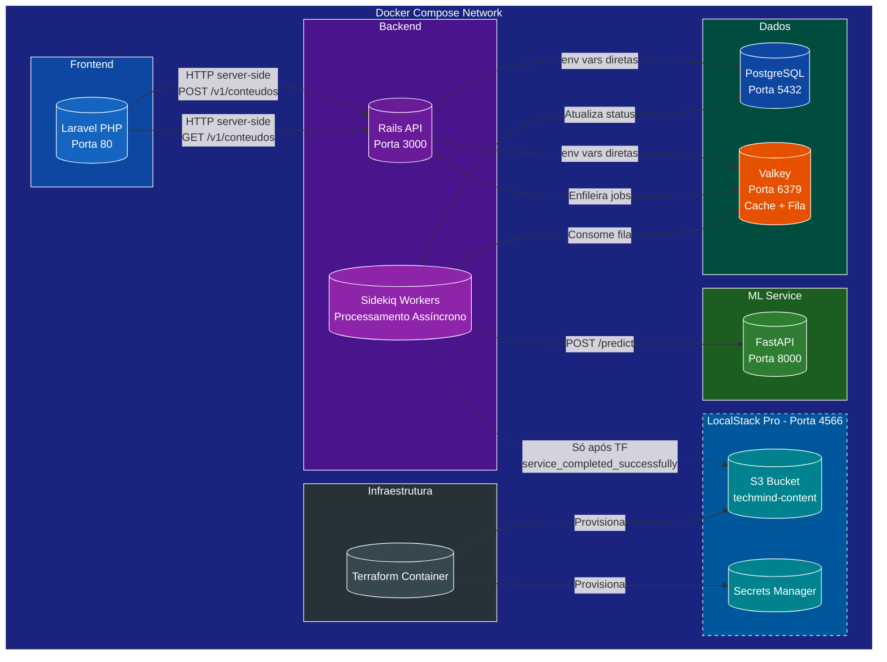
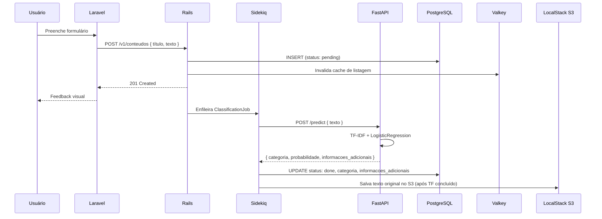
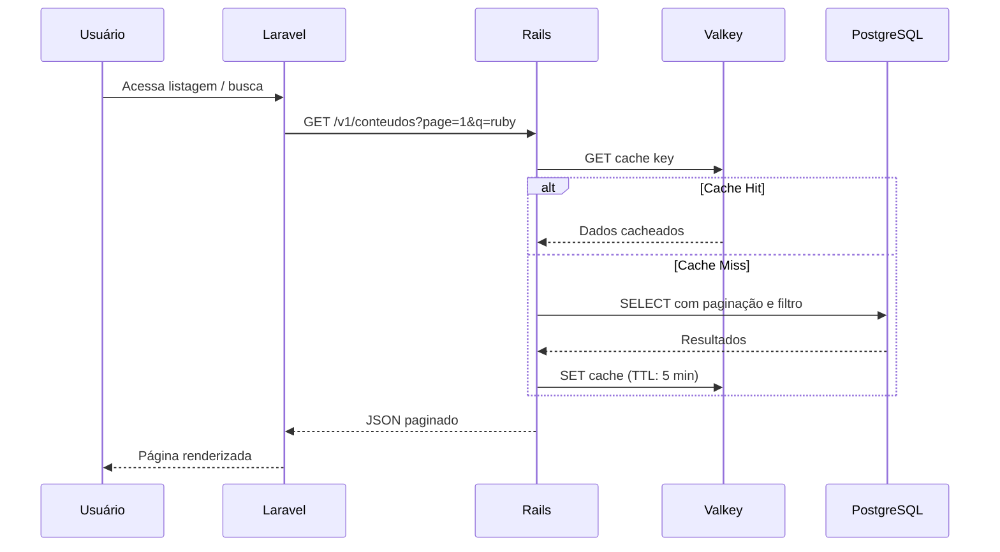
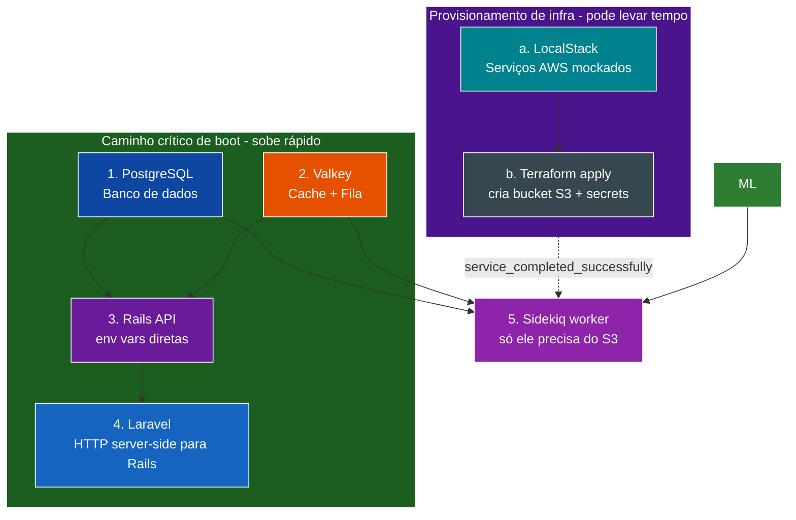

# Arquitetura do Sistema - TechMind

## 1. Visão Geral (C4 Nível 1 - Contexto)

```mermaid
flowchart LR
    Usuario[("<b>Usuário</b><br/>Dev/Estudante)"] -->|Interage via navegador| TM[("<b>TechMind System</b><br/>Organização Inteligente<br/>de Conhecimento")]

    style Usuario fill:#4E342E,color:#fff,stroke:#fff,stroke-width:2px
    style TM fill:#1A237E,color:#fff,stroke:#fff,stroke-width:3px
```

O usuário interage com o sistema via navegador web para cadastrar e consultar conteúdos técnicos.

## 2. Diagrama de Containers (C4 Nível 2)



### Observações importantes

- **Rails e Laravel usam variáveis de ambiente** do `docker-compose.yml` para conectar em PostgreSQL e Valkey. Nenhum serviço crítico depende do Secrets Manager ou do LocalStack para subir.
- **Laravel chama Rails via HTTP server-side** (PHP faz a requisição HTTP para o backend). Sem CORS, sem chamadas diretas do navegador para a API.
- **Apenas o Sidekiq worker depende do Terraform** (via `depends_on: terraform: condition: service_completed_successfully`), pois é ele quem salva artefatos no S3.
- **Rails não salva no S3 nem lê do Secrets Manager durante o boot.** Toda interação com AWS é feita exclusivamente pelo Sidekiq.

## 3. Fluxo de Dados (Cadastro + Classificação)



## 4. Fluxo de Dados (Consulta)



## 5. Decisões Arquiteturais

| Decisão | Opção | Justificativa |
|---|---|---|
| Orquestração | Docker Compose | Simplicidade para MVP, 1 comando para subir tudo |
| API Gateway | Nenhum (direto) | MVP sem necessidade de gateway; reconsiderar com autenticação |
| Banco relacional | PostgreSQL | Maturidade, ecossistema Rails robusto, recursos do LocalStack |
| Cache + Fila | Valkey (Redis OSS) | Compatibilidade total com Sidekiq, open source |
| ML assíncrono | Sidekiq job | Não bloquear o request do usuário; resiliência com retry |
| ML como serviço separado | FastAPI + scikit-learn | Separação de concerns; permite escalar ML independentemente |
| Infra mockada | LocalStack Pro | Fidelidade à AWS sem custos; S3 e Secrets Manager funcionais |
| Boot sem depender de Secrets Manager | env vars diretas para DB/Valkey | Remove dependência de ordem; serviços críticos sobem sem Terraform |
| Sidekiq espera Terraform | `service_completed_successfully` | Uma linha de config no docker-compose, sem lógica extra |
| Laravel → Rails | HTTP server-side (sem CORS) | Mais simples que chamadas diretas do navegador; sem configurar CORS |
| Quem salva no S3 | Apenas Sidekiq | Rails não precisa de credenciais AWS no boot; responsabilidade única |
| Nome do campo de saída | `informacoes_adicionais` | Nome descritivo para as palavras-chave extraídas pelo ML |

## 6. Ordem de Inicialização dos Containers


