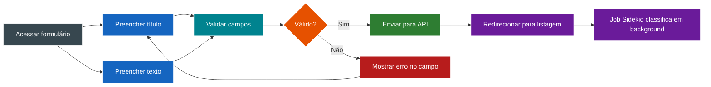
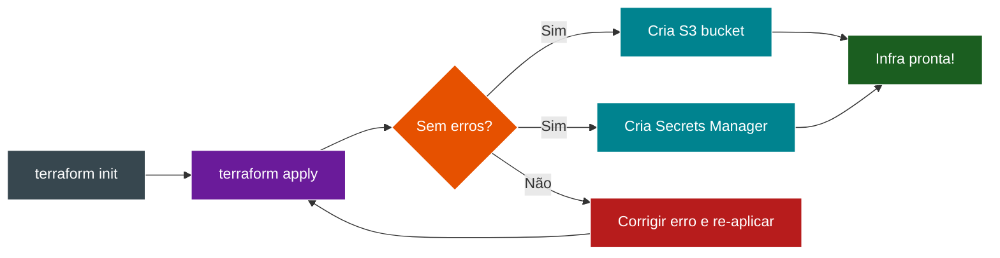
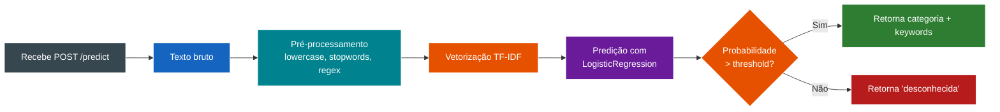

# Histórias de Usuário - TechMind

---

## US01 - Cadastro de Conteúdo

**Como** usuário do sistema
**Quero** cadastrar um conteúdo técnico com título e texto
**Para** que ele seja classificado e armazenado automaticamente

**Critérios de Aceitação:**
- Existe um formulário com campos `titulo` e `texto`
- O título é obrigatório (mín. 3 caracteres, máx. 200)
- O texto é obrigatório (mín. 10 caracteres, máx. 5000)
- Após o envio, o sistema redireciona para a listagem com mensagem de sucesso
- A classificação ocorre em background e o status é atualizado automaticamente

**Prioridade:** Alta
**Estimativa:** M

---

## US02 - Visualização de Conteúdos Classificados

**Como** usuário do sistema
**Quero** ver a listagem dos conteúdos que cadastrei
**Para** consultar a categoria e palavras-chave atribuídas pelo sistema

**Critérios de Aceitação:**
- A listagem exibe título, categoria, palavras-chave e data de criação
- Os resultados são paginados (20 itens por página)
- O usuário pode ordenar por data (mais recentes/mais antigos)
- O status da classificação (pendente/processando/concluído/com falha) é visível

**Prioridade:** Alta
**Estimativa:** P

---

## US03 - Busca por Conteúdo

**Como** usuário do sistema
**Quero** pesquisar conteúdos por título ou palavras-chave
**Para** encontrar rapidamente um conhecimento específico

**Critérios de Aceitação:**
- Existe um campo de busca na página de listagem
- A busca filtra por título (LIKE) e por palavras-chave
- Resultados da busca são paginados
- Buscas frequentes são cacheadas no Valkey

**Prioridade:** Média
**Estimativa:** M

---

## US04 - Visualização Detalhada

**Como** usuário do sistema
**Quero** clicar em um conteúdo para ver seus detalhes completos
**Para** ler o texto completo e ver a classificação atribuída

**Critérios de Aceitação:**
- A página de detalhes exibe título, texto completo, categoria, probabilidade e keywords
- Mostra data de criação e status do processamento
- Se ainda estiver processando, mostra indicador visual

**Prioridade:** Média
**Estimativa:** P

---

## US05 - Infraestrutura Provisionada

**Como** desenvolvedor do projeto
**Quero** executar Terraform uma única vez
**Para** que S3 e Secrets Manager sejam criados automaticamente no LocalStack

**Critérios de Aceitação:**
- `terraform init` e `terraform apply` rodam sem erros
- O bucket S3 `techmind-content` existe após o apply
- Os secrets são criados com valores mockados
- Nenhuma ação manual na AWS é necessária

**Prioridade:** Alta
**Estimativa:** P

---

## US06 - Pipeline de ML Funcional

**Como** desenvolvedor do projeto
**Quero** que o endpoint `/predict` do FastAPI retorne categoria e keywords
**Para** que o Rails possa classificar os conteúdos

**Critérios de Aceitação:**
- `POST /predict` aceita `{ "texto": "..." }`
- Retorna `{ "categoria": "...", "probabilidade": 0.95, "informacoes_adicionais": [...] }`
- O modelo Logistic Regression + TF-IDF está carregado
- Para textos muito diferentes do treinamento, retorna `"categoria": "desconhecida"` se probabilidade < threshold configurável

**Prioridade:** Alta
**Estimativa:** G
