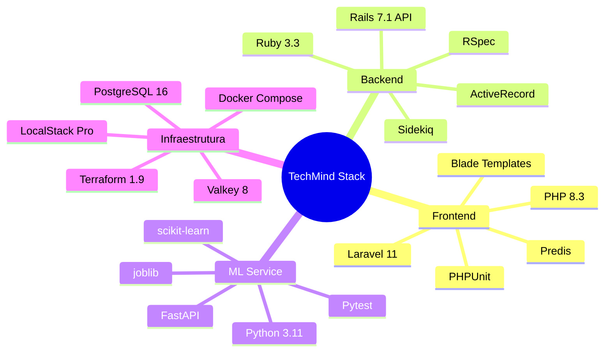

# Stacks Tecnológicas e Justificativas - TechMind

---

## Frontend: PHP 8.x + Laravel 11

| Aspecto | Detalhe |
|---|---|
| Versão | PHP 8.3+, Laravel 11 |
| Servidor | `php artisan serve` via Docker |
| Testes | PHPUnit |
| Cache | Integração com Valkey via `predis` |

**Justificativa:** Laravel é um dos frameworks PHP mais maduros, com ecossistema rico para construção rápida de interfaces. Blade para templates, Eloquent para ORM (quando aplicável) e ampla documentação.

---

## Backend: Ruby 3.x + Rails 7 (API Mode)

| Aspecto | Detalhe |
|---|---|
| Versão | Ruby 3.3+, Rails 7.1+ |
| Servidor | Puma via Docker |
| Testes | RSpec + FactoryBot |
| Cache | `redis-rb` + Valkey |
| Fila | Sidekiq + Valkey |
| ORM | ActiveRecord + PostgreSQL |

**Justificativa:** Rails em modo API é leve e produtivo para construir REST APIs. Sidekiq é padrão de mercado para filas no ecossistema Ruby. ActiveRecord oferece maturidade e confiabilidade.

---

## ML Service: Python 3.11 + FastAPI

| Aspecto | Detalhe |
|---|---|
| Versão | Python 3.11+ |
| Framework | FastAPI |
| ML | scikit-learn (LogisticRegression + TF-IDF) |
| Stopwords PT-BR | NLTK `stopwords.words('portuguese')` |
| Serialização | joblib |
| Testes | Pytest |
| Servidor | Uvicorn via Docker |

**Justificativa:** FastAPI é performático (ASGI), com documentação automática (OpenAPI). scikit-learn é suficiente para classificação de texto com TF-IDF, sem necessidade de deep learning para o MVP. joblib é o formato padrão para serialização de modelos sklearn.

### Taxonomia de Categorias

O modelo será treinado para classificar conteúdos nas seguintes 8 categorias:

| Categoria | Exemplos de conteúdo |
|---|---|
| **Backend** | APIs, bancos de dados, servidores, linguagens (Ruby, PHP, Python, Java) |
| **Frontend** | React, Vue, Angular, CSS, HTML, JavaScript, TypeScript |
| **DevOps & Infraestrutura** | Docker, Kubernetes, Terraform, CI/CD, cloud, monitoramento |
| **Dados & ML** | Machine Learning, análise de dados, SQL avançado, estatística |
| **Mobile** | Android, iOS, React Native, Flutter, Swift, Kotlin |
| **Segurança** | Criptografia, autenticação, OWASP, boas práticas de segurança |
| **Arquitetura & Design** | Padrões de projeto, arquitetura de software, microserviços, clean architecture |
| **Carreira & Soft Skills** | Produtividade, liderança, comunicação, metodologias ágeis |

### Stopwords em Português (PT-BR)

O pipeline de pré-processamento utilizará `nltk.corpus.stopwords.words('portuguese')` para remoção de stopwords. A biblioteca NLTK é leve, bem integrada ao ecossistema scikit-learn, e cobre as stopwords mais comuns da língua portuguesa. Se necessário, a lista será complementada com termos técnicos muito frequentes (ex: "artigo", "tutorial", "guia") que não agregam valor à classificação.

---

## Infraestrutura: Terraform + LocalStack Pro

| Aspecto | Detalhe |
|---|---|
| Terraform | 1.9+ |
| LocalStack | Pro (imagem `localstack/localstack-pro`) |
| Serviços | S3, Secrets Manager |
| Banco real | PostgreSQL 16 (container) |

**Justificativa:** LocalStack Pro oferece mock fiel de serviços AWS como S3 e Secrets Manager sem custos de cloud real. Terraform garante provisionamento declarativo e idempotente. PostgreSQL real em container separado para maior confiabilidade vs mock de RDS.

---

## Cache e Filas: Valkey

| Aspecto | Detalhe |
|---|---|
| Versão | Valkey 8+ |
| Uso | Cache de queries + backend do Sidekiq |
| Imagem | `valkey/valkey` |

**Justificativa:** Valkey é o fork open source do Redis mantido pela Linux Foundation, compatível com todos os clientes Redis. Sem licenciamento proprietário, adequado para ambientes corporativos que exigem software 100% open source.

---

## Orquestração: Docker Compose

| Aspecto | Detalhe |
|---|---|
| Docker | 24+ |
| Compose | V2 (plugin) |
| Rede | Bridge interna para comunicação entre serviços |

**Justificativa:** Docker Compose é a ferramenta mais simples e direta para orquestração local. Para um MVP com 7 containers, oferece o equilíbrio ideal entre simplicidade e funcionalidade.

---

## Stack Completa (Resumo)

```mermaid
flowchart TB
    subgraph Frontend
        PHP[PHP 8.3]
        LARAVEL[Laravel 11]
        BLADE[Blade]
        PHPUNIT[PHPUnit]
        PREDIS[Predis]
    end

    subgraph Backend
        RUBY[Ruby 3.3]
        RAILS[Rails 7.1]
        SIDEKIQ[Sidekiq]
        RSPEC[RSpec]
        AR[ActiveRecord]
    end

    subgraph ML
        PY[Python 3.11]
        FASTAPI[FastAPI]
        SKLEARN[scikit-learn]
        JOBLIB[joblib]
        PYTEST[Pytest]
    end

    subgraph Infra
        TF[Terraform 1.9]
        LS[LocalStack Pro]
        DC[Docker Compose]
        VK[Valkey 8]
        PG[PostgreSQL 16]
    end

    Frontend --> Backend
    Backend --> ML
    Backend --> Infra
    ML --> Infra

    style Frontend fill:#0D47A1,color:#fff,stroke:#fff
    style PHP fill:#1565C0,color:#fff,stroke:#fff
    style LARAVEL fill:#1565C0,color:#fff,stroke:#fff
    style BLADE fill:#1976D2,color:#fff,stroke:#fff
    style PHPUNIT fill:#1976D2,color:#fff,stroke:#fff
    style PREDIS fill:#1976D2,color:#fff,stroke:#fff
    style Backend fill:#4A148C,color:#fff,stroke:#fff
    style RUBY fill:#6A1B9A,color:#fff,stroke:#fff
    style RAILS fill:#6A1B9A,color:#fff,stroke:#fff
    style SIDEKIQ fill:#8E24AA,color:#fff,stroke:#fff
    style RSPEC fill:#8E24AA,color:#fff,stroke:#fff
    style AR fill:#8E24AA,color:#fff,stroke:#fff
    style ML fill:#1B5E20,color:#fff,stroke:#fff
    style PY fill:#2E7D32,color:#fff,stroke:#fff
    style FASTAPI fill:#2E7D32,color:#fff,stroke:#fff
    style SKLEARN fill:#388E3C,color:#fff,stroke:#fff
    style JOBLIB fill:#388E3C,color:#fff,stroke:#fff
    style PYTEST fill:#388E3C,color:#fff,stroke:#fff
    style Infra fill:#263238,color:#fff,stroke:#fff
    style TF fill:#37474F,color:#fff,stroke:#fff
    style LS fill:#00838F,color:#fff,stroke:#fff
    style DC fill:#455A64,color:#fff,stroke:#fff
    style VK fill:#E65100,color:#fff,stroke:#fff
    style PG fill:#0D47A1,color:#fff,stroke:#fff
```

