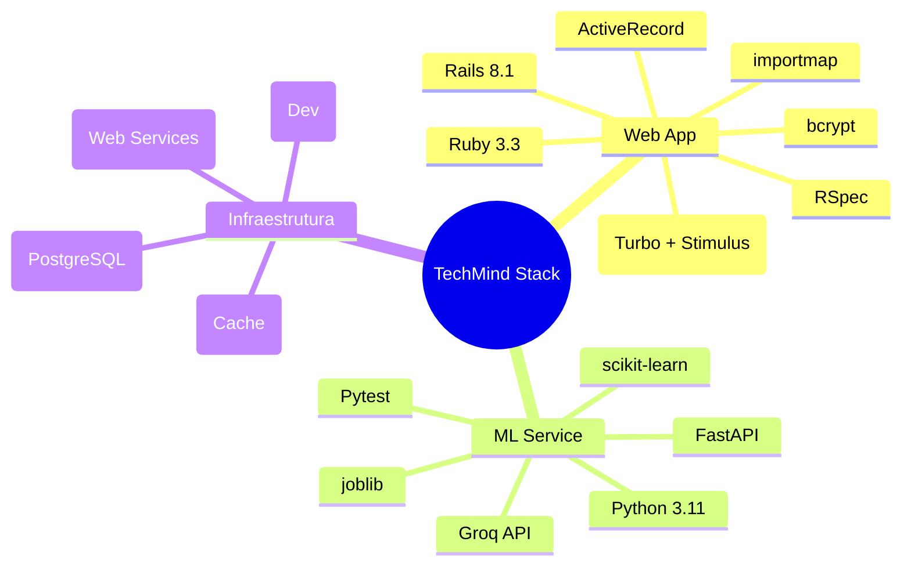

# Stacks Tecnológicas e Justificativas - TechMind

---

## Web App: Rails 8 + Hotwire

| Aspecto | Detalhe |
|---|---|
| Versão | Ruby 3.3+, Rails 8.1+ |
| Servidor | Puma via Docker / Render |
| Frontend | **Hotwire (Turbo + Stimulus)** — HTML over the wire |
| Assets | **importmap** (sem Node.js, sem bundlers) |
| Testes | RSpec + FactoryBot + WebMock |
| ORM | ActiveRecord + PostgreSQL |
| Cache | `redis-rb` + Valkey (ou cache em memória) |
| Auth | `has_secure_password` (bcrypt) — nativo do Rails |
| Sessão | Cookie criptografado (adequado para Render free) |
| I18n | `rails-i18n` + `config.i18n.fallbacks = true` |

### Por que Rails 8 full-stack (sem Laravel)?

| Alternativa | Problema |
|---|---|
| **Laravel + Rails** | Over-engineering: 2 frameworks web, 2 deploys, 2× RAM, latência HTTP |
| **Laravel sozinho** | Exigiria adaptar ML orchestration para PHP |
| **Rails API + SPA** | Complexidade desnecessária para MVP; Hotwire é mais produtivo |

**Rails 8 full-stack resolve tudo num serviço só:** renderiza HTML (Hotwire), serve API JSON, autentica usuários, gerencia cache, orquestra ML.

### Hotwire (Turbo + Stimulus)

| Componente | Função |
|---|---|
| **Turbo Drive** | Navegação SPA-like sem recarregar a página |
| **Turbo Frames** | Componentes independentes que atualizam sem refresh |
| **Turbo Streams** | Atualizações em tempo real via WebSocket (ActionCable) |
| **Stimulus** | JavaScript mínimo para interações específicas |

**Justificativa:** Hotwire é o padrão Rails 8 para frontend. Zero configuração de bundler, zero dependências npm, zero compilação. HTML é servido pelo servidor, Turbo acelera a navegação, Stimulus adiciona interatividade onde necessário.

---

## ML Service: FastAPI + scikit-learn + Groq

| Aspecto | Detalhe |
|---|---|
| Versão | Python 3.11+ |
| Framework | FastAPI (ASGI) |
| ML Local | scikit-learn (LogisticRegression + TF-IDF) |
| Stopwords | NLTK (português) |
| Serialização | joblib |
| Fallback LLM | Groq API (`llama-3.1-8b-instant`) |
| Testes | Pytest |
| Servidor | Uvicorn (1 worker) |

**Justificativa:** FastAPI é leve e performático. scikit-learn é suficiente para classificação de texto (TF-IDF) — milissegundos de inferência. Groq API como fallback para casos ambíguos, com latência de ~300-500ms.

---

## Hospedagem: Render (2 Web Services)

| Serviço | RAM | Tier |
|---|---|---|
| **Rails** | 512 MB | Render Free |
| **FastAPI** | 512 MB | Render Free |

**Limitações do free tier:**
- Spin-down após 15 min de inatividade
- Cold start de ~30-60s no primeiro request
- 750h/mês por workspace
- Filesystem efêmero (sessão em cookie, não em arquivo)

---

## Banco: Supabase (PostgreSQL)

| Aspecto | Detalhe |
|---|---|
| Armazenamento | 500MB gratuitos |
| Conexões | Máx 2 simultâneas |
| Expiração | **Sem expiração** |
| Recursos | Arrays, índices GIN, ILIKE |

---

## Cache: Redis Cloud / Valkey

| Aspecto | Detalhe |
|---|---|
| Free tier | 30MB (Redis Cloud) |
| Fallback | Cache em memória do Rails |
| Timeout | 2s |

---

## LLM Fallback: Groq API

| Aspecto | Detalhe |
|---|---|
| Modelo | `llama-3.1-8b-instant` |
| Free Tier | 30 RPM / 14.400 RPD |
| Timeout | 5s |

---

## Estratégias de Resiliência por Stack

### Rails

| Desafio | Estratégia |
|---|---|
| Pool DB limitado (Supabase: 2 conexões) | `pool: 1` no database.yml |
| ML Service lento ou dormindo | Timeout de 8s; conteúdo vira `failed` |
| Redis fora do ar | Cache em memória como fallback |
| Memória limitada (512MB) | `RAILS_MAX_THREADS=1`, `WEB_CONCURRENCY=0` |
| Filesystem efêmero | Sessão em cookie (`SESSION_DRIVER=cookie`) |
| Rate limit no login | 10 tentativas/minuto via Rack::Attack |

### FastAPI

| Desafio | Estratégia |
|---|---|
| Groq API lenta ou 429 | Timeout de 5s; retorna "Desconhecida" |
| Memória limitada (512MB) | `--workers 1` no Uvicorn |
| Modelo .joblib | Carregado 1x no startup (evita recarregar) |

> 📖 **Detalhes:** [`docs/11-responsabilidades-e-resiliencia.md`](11-responsabilidades-e-resiliencia.md)
