# Decisões de Projeto - TechMind

Este documento registra as decisões tomadas durante a fase de planejamento, incluindo o racional de cada escolha.

---

## Matriz de Decisões

| # | Decisão | Escolha | Status | Justificativa |
|---|---|---|---|---|
| 1 | Autenticação | Opcional pós-MVP | Fechada | Evitar complexidade inicial; adicionar após validação do MVP |
| 2 | Cache | Valkey (Redis OSS) | Fechada | Open source, compatível com Redis, sem licenciamento proprietário |
| 3 | Filas/Processamento | Sidekiq (assíncrono) | Fechada | Padrão no ecossistema Rails, resiliência com retry |
| 4 | Observabilidade | Logs JSON + health checks + métricas | Fechada | Essencial para depuração e monitoramento em ambiente Docker |
| 5 | Gerenciamento de Secrets | AWS Secrets Manager (LocalStack) | Fechada | Evita hardcoded credentials; simula ambiente produtivo |
| 6 | Testes | RSpec / Pytest / PHPUnit | Fechada | Frameworks padrão de cada ecossistema |
| 7 | Versionamento API | `/v1/` prefixo | Fechada | Boa prática para evolução da API sem quebrar consumidores |
| 8 | Modelo de ML | Logistic Regression + TF-IDF | Fechada | Suficiente para MVP; simples de treinar e interpretar |
| 9 | Rate Limiting | 100 req/min/IP | Fechada | Proteção básica contra abuso |
| 10 | RDS vs PostgreSQL container | PostgreSQL container real | Fechada | Mock de RDS no LocalStack tem limitações; container real é mais confiável |
| 11 | Paginação | 20 itens/página | Fechada | Padrão aceitável para MVP |
| 12 | Boot sem depender de Secrets Manager | env vars diretas para DB/Valkey | Fechada | Remove dependência de ordem; serviços críticos sobem sem Terraform |
| 13 | Sidekiq espera Terraform | `service_completed_successfully` | Fechada | Uma linha de config no docker-compose, sem lógica extra |
| 14 | Laravel chama Rails | HTTP server-side (sem CORS) | Fechada | Mais simples que chamadas diretas do navegador |
| 15 | Quem salva no S3 | Apenas Sidekiq | Fechada | Rails não precisa de credenciais AWS no boot |
| 16 | Taxonomia de categorias | 8 categorias definidas | Fechada | Lista em `05-stacks-e-justificativas.md` |
| 17 | Stopwords PT-BR | NLTK `stopwords.words('portuguese')` | Fechada | Biblioteca leve e bem integrada ao sklearn |
| 18 | Campo de saída do ML | `informacoes_adicionais` | Fechada | Nome descritivo e único em todos os documentos |

```mermaid
flowchart LR
    subgraph Decidido
        D2[Cache: Valkey]
        D3[Filas: Sidekiq]
        D4[Observabilidade]
        D5[Secrets: AWS SM]
        D6[Testes]
        D7[API Versioning]
        D8[ML: LogReg + TF-IDF]
        D9[Rate Limiting]
        D10[PG Container]
        D11[Paginação 20/pág]
    end

    subgraph Pós-MVP
        D1[Autenticação]
    end

    Decidido --> Pós-MVP

    style Decidido fill:#1A237E,color:#fff,stroke:#fff
    style D2 fill:#1B5E20,color:#fff,stroke:#fff
    style D3 fill:#1B5E20,color:#fff,stroke:#fff
    style D4 fill:#1B5E20,color:#fff,stroke:#fff
    style D5 fill:#1B5E20,color:#fff,stroke:#fff
    style D6 fill:#1B5E20,color:#fff,stroke:#fff
    style D7 fill:#1B5E20,color:#fff,stroke:#fff
    style D8 fill:#1B5E20,color:#fff,stroke:#fff
    style D9 fill:#1B5E20,color:#fff,stroke:#fff
    style D10 fill:#1B5E20,color:#fff,stroke:#fff
    style D11 fill:#1B5E20,color:#fff,stroke:#fff
    style Pós-MVP fill:#4A148C,color:#fff,stroke:#fff
    style D1 fill:#E65100,color:#fff,stroke:#fff
```

---

## Decisões Postergadas (Pós-MVP)

| Decisão | Motivo do Adiamento |
|---|---|
| Autenticação (JWT/Sanctum) | Aumentaria complexidade inicial sem valor imediato para o MVP |
| CI/CD (GitHub Actions) | Será adicionado quando houver testes estáveis e deploy definido |
| Frontend SPA (React/Vue) | Laravel Blade é suficiente para MVP; SPA adiciona complexidade |
| Deploy em cloud real | MVP roda apenas localmente via Docker |
| Monitoramento avançado (Datadog/Grafana) | Logs JSON + health checks são suficientes para o escopo inicial |
| Pipeline de CI/CD para ML (retreinamento) | Modelo será treinado uma vez no notebook; retreinamento pode vir depois |
| Índice avançado de busca (GIN/trigram) | Com paginação de 20 itens e escopo MVP, LIKE com índice btree simples já resolve |
| Invalidar cache ao concluir classificação (não só ao cadastrar) | Janela de até 5 min de status desatualizado, aceitável para MVP |
| Reprocessamento manual de conteúdo `failed` | Será implementado como UX futura quando houver autenticação |
| Uso real de segredos do Secrets Manager por algum serviço | Terraform continua criando o secret (RNF07), mas nenhum serviço consome no boot |
