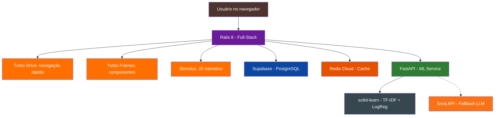

# Glossário - TechMind

| Termo | Definição |
|---|---|
| **bcrypt** | Algoritmo de hash de senhas, padrão no Rails (`has_secure_password`) |
| **Cold Start** | Atraso no primeiro request após inatividade no Render Free (~30-60s) |
| **Free Tier** | Camada gratuita de um serviço cloud com recursos limitados |
| **Groq API** | Plataforma de inferência LLM ultrarrápida via LPU |
| **has_secure_password** | Método do Rails para autenticação com bcrypt |
| **Hotwire** | Conjunto de ferramentas (Turbo + Stimulus) para criar aplicações HTML dinâmicas sem SPA |
| **importmap** | Sistema de gerenciamento de JavaScript sem bundlers (Node.js não necessário) |
| **LPU** | Language Processing Unit — hardware especializado da Groq |
| **MVP** | Minimum Viable Product |
| **Rails 8** | Framework full-stack Ruby: HTML, API, ORM, Cache, tudo num serviço só |
| **Stimulus** | Framework JavaScript minimalista do Hotwire para interações específicas |
| **Supabase** | Plataforma open source com PostgreSQL gratuito (500MB) |
| **TF-IDF** | Term Frequency-Inverse Document Frequency — técnica de vetorização de texto |
| **Turbo** | Conjunto de bibliotecas Hotwire (Drive + Frames + Streams) para navegação rápida |
| **Valkey** | Fork open source do Redis |
| **Vite** | Alternativa ao importmap (para projetos que precisam de bundler) |

## Relações entre Conceitos

