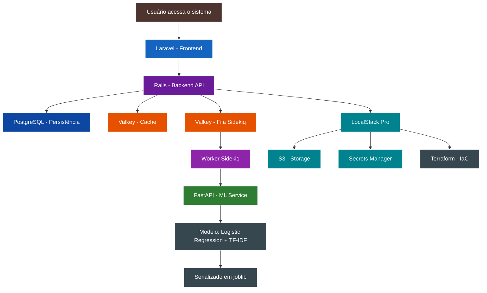

# Glossário - TechMind

| Termo | Definição |
|---|---|
| **API Gateway** | Ponto único de entrada para requisições a microsserviços |
| **ASGI** | Asynchronous Server Gateway Interface (padrão do FastAPI) |
| **C4 Model** | Modelo de diagramação de arquitetura de software em 4 níveis (Contexto, Container, Componente, Código) |
| **Conteúdo técnico** | Texto informativo sobre tecnologia (artigos, tutoriais, documentação) |
| **EDA** | Exploratory Data Analysis - análise exploratória dos dados |
| **IaC** | Infrastructure as Code - infraestrutura gerenciada via código (Terraform) |
| **Idempotente** | Operação que produz o mesmo resultado independente de quantas vezes é executada |
| **INVEST** | Acrônimo para boas histórias de usuário: Independent, Negotiable, Valuable, Estimable, Small, Testable |
| **Job (Sidekiq)** | Unidade de trabalho assíncrono processada em background |
| **joblib** | Biblioteca Python para serialização eficiente de modelos scikit-learn |
| **Logistic Regression** | Algoritmo de classificação linear usado como baseline em ML |
| **LocalStack** | Emulador local de serviços AWS para desenvolvimento e testes |
| **MVP** | Minimum Viable Product - versão mínima funcional do produto |
| **RDS** | Relational Database Service - serviço AWS de banco relacional |
| **S3** | Simple Storage Service - serviço AWS de armazenamento de objetos |
| **Secrets Manager** | Serviço AWS para gerenciamento de segredos e credenciais |
| **Sidekiq** | Framework de processamento de filas em background para Ruby |
| **TF-IDF** | Term Frequency-Inverse Document Frequency - técnica de vetorização de texto para ML |
| **Valkey** | Fork open source do Redis, mantido pela Linux Foundation |
| **Worker (Sidekiq)** | Processo que consome jobs da fila e executa a lógica associada |

## Relações entre Conceitos

