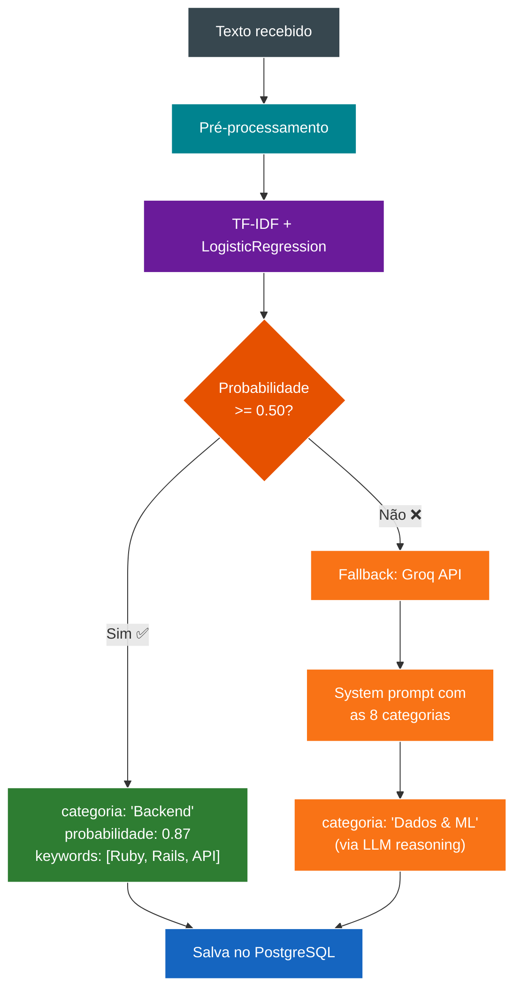
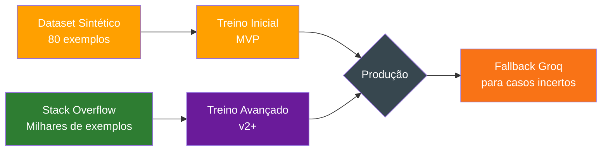

# Taxonomia de Categorias - ML TechMind

## Categorias e Exemplos

O modelo de classificação utilizará as seguintes 8 categorias para classificar conteúdos técnicos:

| # | Categoria | Descrição | Exemplos de conteúdo |
|---|---|---|---|
| 1 | **Backend** | Linguagens, frameworks, APIs, bancos de dados, servidores | Ruby, Rails, PHP, Laravel, Python, Django, Java, Spring, Node.js, PostgreSQL, Redis, REST, GraphQL |
| 2 | **Frontend** | Interfaces web, frameworks de UI, estilos, componentes | React, Vue.js, Angular, CSS, SASS, HTML, JavaScript, TypeScript, Tailwind, Bootstrap |
| 3 | **DevOps & Infraestrutura** | Cloud, containers, orquestração, CI/CD, automação | Docker, Kubernetes, Terraform, AWS, Azure, GitHub Actions, Ansible, Nginx, Linux |
| 4 | **Dados & ML** | Machine Learning, análise de dados, inteligência artificial | Python, Pandas, scikit-learn, TensorFlow, SQL, estatística, ETL, visualização de dados |
| 5 | **Mobile** | Aplicativos móveis, plataformas mobile | Android, Kotlin, iOS, Swift, React Native, Flutter, Ionic |
| 6 | **Segurança** | Proteção de sistemas, criptografia, autenticação | OWASP, JWT, OAuth, criptografia, firewall, pentest, LGPD |
| 7 | **Arquitetura & Design** | Padrões de projeto, arquitetura de software, boas práticas | Microserviços, Clean Architecture, SOLID, DDD, MVC, Design Patterns, UML |
| 8 | **Carreira & Soft Skills** | Desenvolvimento profissional, produtividade, gestão | Liderança, comunicação, agilidade, produtividade, code review, mentoria |

## Estratégia de Classificação Híbrida

### Camada 1: Modelo Local (rápido e econômico)

- Algoritmo: **Logistic Regression** com vetorização **TF-IDF**
- O modelo retorna uma probabilidade para cada categoria
- A categoria escolhida é a de maior probabilidade, **desde que** a probabilidade >= `ML_THRESHOLD` (default 0.50)
- As palavras-chave (`informacoes_adicionais`) são os **top 5 termos com maior peso TF-IDF**
- **Tempo de inferência:** < 50ms

### Camada 2: Fallback Groq (para casos ambíguos)

- Se a maior probabilidade do modelo local for **inferior ao threshold**, chama a **Groq API**
- A Groq usa o modelo `llama-3.1-8b-instant` com um **system prompt** que instrui:
  - Classificar o texto estritamente dentro das 8 categorias
  - Retornar resposta em formato JSON estruturado
  - Se não se encaixar em nenhuma categoria, retornar `"Desconhecida"`
- **Tempo de inferência:** ~300-500ms (LPU)

### Matriz de Decisão

| Confiança ML Local | Ação | Responsável | Custo |
|---|---|---|---|
| >= 0.50 | ✅ Usa resultado local | scikit-learn (rápido) | Grátis |
| < 0.50 | 🔄 Fallback para Groq | Groq API (LLM) | 0 (free tier) |
| Modelo não carregado | 🔄 Fallback para Groq | Groq API (LLM) | 0 (free tier) |
| Ambos indisponíveis | ❌ Retorna 503 | — | — |




## Exemplos

### Classificação local (confiança alta)

```json
{
  "categoria": "Backend",
  "probabilidade": 0.87,
  "informacoes_adicionais": ["Ruby", "Rails", "API", "REST", "ActiveRecord"]
}
```

### Fallback Groq (confiança baixa)

```json
{
  "categoria": "Dados & ML",
  "probabilidade": 0.0,
  "informacoes_adicionais": ["machine learning", "dados", "classificação"]
}
```

## Dataset Real (Stack Overflow)

Além do dataset sintético, o TechMind possui um pipeline para baixar e preparar dados reais do **Stack Overflow**:

```bash
python services/ml/scripts/prepare_dataset.py
```

### Como funciona

1. **Fonte:** [c17hawke/stackoverflow-dataset](https://huggingface.co/datasets/c17hawke/stackoverflow-dataset) no Hugging Face ou [Facebook Recruiting III](https://www.kaggle.com/c/facebook-recruiting-iii-keyword-extraction) no Kaggle
2. **Mapeamento:** ~250 tags do Stack Overflow são mapeadas para as 8 categorias do TechMind (ex: `docker` → `DevOps & Infraestrutura`, `reactjs` → `Frontend`)
3. **Balanceamento:** Opção `--max-per-category` para limitar exemplos por categoria
4. **Saída:** `services/ml/data/train_real.csv` — substitui ou complementa o dataset sintético

### Mapeamento Tag → Categoria

O arquivo `services/ml/scripts/tag_mapping.py` contém ~250 tags mapeadas:

| Categoria | Exemplos de Tags |
|---|---|
| Backend | ruby-on-rails, python, java, node.js, postgresql, api, rest |
| Frontend | reactjs, angular, vue.js, css, tailwind-css, webpack |
| DevOps & Infraestrutura | docker, kubernetes, terraform, aws, linux, nginx |
| Dados & ML | machine-learning, tensorflow, pytorch, pandas, nlp |
| Mobile | android, ios, swift, flutter, react-native |
| Segurança | security, oauth, jwt, encryption, owasp |
| Arquitetura & Design | design-patterns, microservices, clean-architecture, solid |
| Carreira & Soft Skills | career-development, code-review, agile, mentoring |

### Como usar no treinamento

No notebook `services/ml/notebooks/techmind_ml.ipynb`, altere:

```python
# Dataset sintético (MVP):
DATA_PATH = os.path.join('..', 'data', 'train.csv')
# Dataset real do Stack Overflow:
DATA_PATH = os.path.join('..', 'data', 'train_real.csv')
```

### Estratégia Híbrida Recomendada



## Limitações do MVP

- **Dataset pequeno:** 80 exemplos sintéticos (10 por categoria) — baseline suficiente para validar o fluxo. O fallback Groq compensa a baixa acurácia do modelo local em casos ambíguos. Com o dataset real do Stack Overflow, a acurácia esperada sobe para ~85-90%.
- **Cobertura linguística:** Textos sintéticos podem não representar a variedade de estilos de escrita reais. À medida que usuários cadastrarem mais conteúdos, o dataset pode ser expandido para re-treinar o modelo local.
- **Extração de keywords:** Top 5 TF-IDF por documento (dinâmica). Pode incluir ruído em textos muito curtos.
- **Fallback Groq:** Depende de conectividade com a internet e do rate limit da API (30 RPM no free tier).

## Evolução Futura

- A taxonomia pode ser expandida com subcategorias conforme o volume de conteúdos crescer
- O threshold (0.50) pode ser ajustado via `ML_THRESHOLD` após validação com dados reais
- O dataset de treino pode ser aumentado com conteúdos classificados via Groq (após revisão)
- O modelo local pode ser re-treinado periodicamente com dados reais para reduzir dependência do fallback
- Novas categorias podem ser adicionadas sem retreinar todo o modelo (apenas duas classes)
