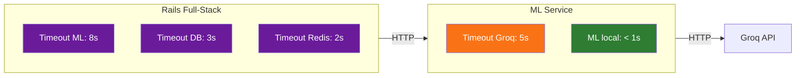

# Responsabilidades e Resiliência entre Serviços - TechMind

> **Propósito:** Definir as responsabilidades de cada serviço (Rails full-stack + FastAPI), estabelecer limites de recursos para free tier e documentar padrões de resiliência.

---

## 1. Mapa de Responsabilidades

### 1.1 Rails 8 Full-Stack — Responsabilidades

| Responsabilidade | Detalhes |
|---|---|
| ✅ **Renderizar HTML** | Páginas com Hotwire (Turbo + Stimulus) |
| ✅ **Autenticar usuários** | Login, cadastro, sessão via `has_secure_password` + bcrypt |
| ✅ **CRUD de conteúdos** | Criar, listar, buscar, detalhar (sempre escopado por `user_id`) |
| ✅ **Chamar ML Service** | `POST /predict` para classificação de textos (timeout: 8s) |
| ✅ **Gerenciar cache** | Redis/Valkey para listagens; cache em memória como fallback |
| ✅ **Rate limiting** | Rack::Attack (100 req/min geral, 10 req/min login) |
| ✅ **Health check** | `GET /health` com status do banco e Redis |
| ❌ **NÃO classificar textos** | Delega ao FastAPI (ML Service) |
| ❌ **NÃO chamar Groq diretamente** | Apenas o ML Service chama a Groq API |
| ❌ **NÃO armazenar arquivos** | Apenas texto no PostgreSQL |

### 1.2 FastAPI (ML Service) — Responsabilidades

| Responsabilidade | Detalhes |
|---|---|
| ✅ **Classificar textos (ML local)** | TF-IDF + LogisticRegression |
| ✅ **Extrair palavras-chave** | Top 5 termos TF-IDF |
| ✅ **Fallback Groq API** | Quando confiança do modelo local < threshold (timeout: 5s) |
| ✅ **Health check** | `GET /health` com status do modelo e Groq |
| ❌ **NÃO armazenar dados** | ML Service é stateless; sem banco |
| ❌ **NÃO autenticar** | Chamado apenas internamente pelo Rails |
| ❌ **NÃO saber quem é o usuário** | Recebe apenas o texto |

---

## 2. Limites de Recursos (Free Tier)

| Serviço | RAM | Workers | Pool DB | Timeouts |
|---|---|---|---|---|
| **Rails** | 512 MB (Render Free) | 1 Puma (1 thread) | **1 conexão** | DB: 3s / Redis: 2s / ML: 8s |
| **FastAPI** | 512 MB (Render Free) | 1 Uvicorn | Stateless | Groq: 5s |

**Configurações obrigatórias:**

```yaml
# Rails (database.yml)
pool: 1

# Rails (Puma)
RAILS_MAX_THREADS: 1
WEB_CONCURRENCY: 0

# FastAPI (Uvicorn)
--workers 1
```

> **🚨 Supabase free tier:** Máximo de 2 conexões simultâneas. Pool = 1 garante margem segura.

---

## 3. Timeouts (Não Bloquie Nunca)



| Chamada | Timeout | Comportamento ao estourar |
|---|---|---|
| Rails → FastAPI (/predict) | **8s** | Salva conteúdo como `failed`, mostra erro ao usuário |
| Rails → PostgreSQL | **3s** | Retorna 503 |
| Rails → Redis | **2s** | Usa cache em memória |
| FastAPI → Groq API | **5s** | Retorna "Desconhecida" |

---

## 4. Degradação Graciosa

| Dependência Indisponível | Efeito | Como o Usuário Percebe |
|---|---|---|
| **PostgreSQL** | Rails retorna 503 | Página de erro |
| **Redis** | Rails usa cache em memória | Sem diferença perceptível |
| **ML Service** (timeout) | Conteúdo salvo como `failed` | Conteúdo sem classificação |
| **ML Service** (lento/cold start) | Rails espera até 8s | Request lento, mas classifica |
| **Groq API** (429/erro) | ML retorna "Desconhecida" | Categoria genérica |

---

## 5. Blast Radius


**Princípios:**
1. Nenhum serviço conhece o estado interno de outro
2. Dados ficam no PostgreSQL (serviços são stateless)
3. Toda chamada síncrona tem timeout
4. Nenhum serviço depende de outro para inicializar

---

## 6. Sessão no Render (Filesystem Efêmero)

Render Free Tier tem **filesystem efêmero**: dados em disco são perdidos no restart.

**Solução:** `SESSION_DRIVER=cookie` — sessão armazenada em cookie criptografado no navegador.

**Vantagens:**
- Sobrevive a restarts do Render
- Sem dependência de banco ou Redis para sessão
- Configuração simples (1 env var)

---

## Relacionamento com outros documentos

| Documento | Conexão |
|---|---|
| `00-visao-geral.md` | Princípios de isolamento entre serviços |
| `02-requisitos-nao-funcionais.md` (RNF10) | Resiliência Free Tier |
| `03-arquitetura.md` | Diagrama de containers + fluxos |
| `05-stacks-e-justificativas.md` | Limites de recursos por stack |
| `10-variaveis-de-ambiente.md` | Timeouts, pools, workers |
